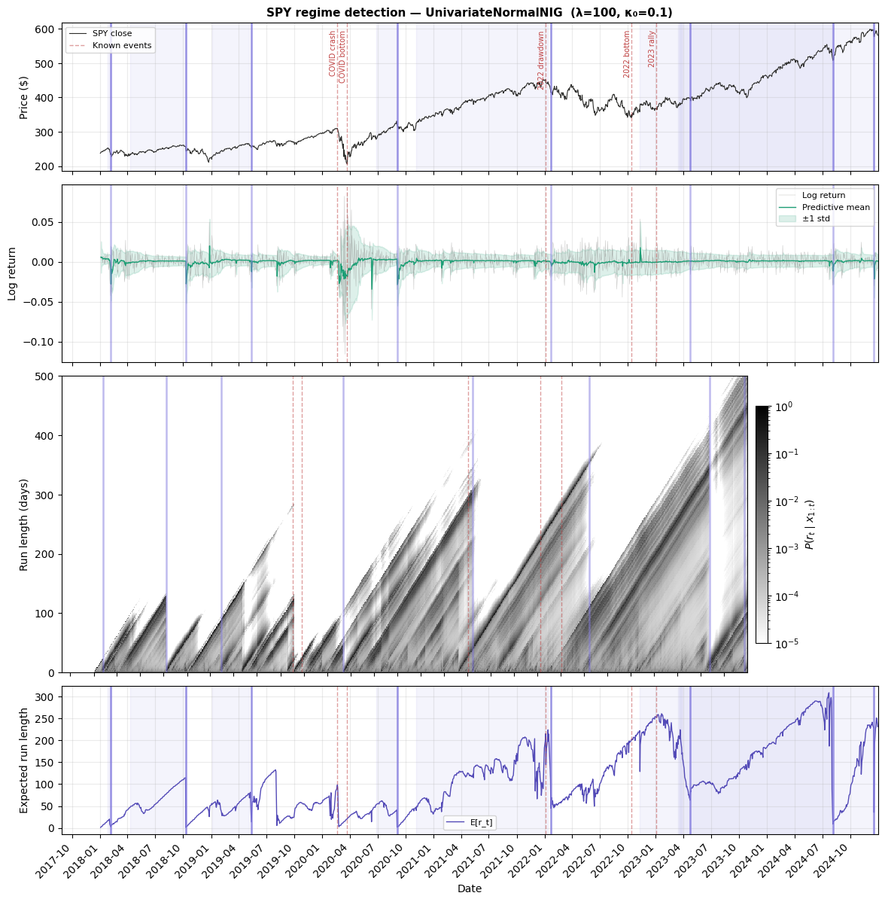

# SPY Regime Detection with BOCPD

Bayesian Online Change Point Detection applied to S&P 500 ETF (SPY)
daily log returns. We use a univariate Normal-Inverse-Gamma model
and constant hazard function.

This notebook showcases the **predictive envelope** — the mixture
predictive mean and standard deviation computed from the run-length
posterior — which is available for univariate models (NIG, PoissonGamma)
but not for the multivariate NIW used in the experiments notebook.

Reference: Adams & MacKay (2007), *Bayesian Online Changepoint Detection*.


```python
import matplotlib.gridspec as gridspec
import matplotlib.pyplot as plt
import numpy as np
from finfeatures.sources import YFinanceSource

from bocpd import (
    BOCPD,
    ConstantHazard,
    UnivariateNormalNIG,
    extract_change_points_with_bounds,
)
from bocpd.plotting import (
    draw_change_points,
    format_xaxis,
    mark_events,
    plot_erl,
    plot_predictive_envelope,
    plot_price,
    plot_run_length_heatmap,
)

KNOWN_EVENTS = {
    "COVID crash": "2020-02-19",
    "COVID bottom": "2020-03-23",
    "2022 drawdown": "2022-01-03",
    "2022 bottom": "2022-10-13",
    "2023 rally": "2023-01-03",
}

print("Imports OK")
```

    Imports OK


## Fetch SPY data


```python
source = YFinanceSource()
df = source.fetch("SPY", start="2018-01-01", end="2024-12-31")
close = df["close"].values
dates = df.index

# Compute log returns
log_returns = np.diff(np.log(close))
dates_returns = dates[1:]

print(f"SPY observations: {len(log_returns)} trading days")
print(f"Date range: {dates_returns[0].date()} to {dates_returns[-1].date()}")
```

    SPY observations: 1759 trading days
    Date range: 2018-01-03 to 2024-12-30


## Run BOCPD


```python
detector = BOCPD(
    model_factory=lambda: UnivariateNormalNIG(
        mu0=0.0, kappa0=0.1, alpha0=1.0, beta0=0.0001
    ),
    hazard_fn=ConstantHazard(lam=100),
)
result = detector.run(log_returns)

boundaries = extract_change_points_with_bounds(result, credible_mass=0.90, min_gap=20)

print(f"Detected {len(boundaries)} change points:")
for b in boundaries:
    idx = b["index"]
    lo = dates_returns[b["lower"]]
    hi = dates_returns[b["upper"]]
    ci_width = (hi - lo).days
    print(
        f"  {dates_returns[idx].strftime('%Y-%m-%d')}  "
        f"90% CI [{lo.strftime('%Y-%m-%d')} -- {hi.strftime('%Y-%m-%d')}]  "
        f"({ci_width}d wide)  severity={b['severity']:.2f}"
    )
```

    Detected 8 change points:
      2018-02-05  90% CI [2018-01-25 -- 2018-02-08]  (14d wide)  severity=0.87
      2018-10-10  90% CI [2018-04-10 -- 2018-10-09]  (182d wide)  severity=0.99
      2019-05-13  90% CI [2019-01-04 -- 2019-05-06]  (122d wide)  severity=0.83
      2020-09-03  90% CI [2020-06-26 -- 2020-09-02]  (68d wide)  severity=0.97
      2022-01-21  90% CI [2020-11-04 -- 2022-01-11]  (433d wide)  severity=0.80
      2023-04-24  90% CI [2022-11-10 -- 2023-03-27]  (137d wide)  severity=0.72
      2024-08-05  90% CI [2023-03-20 -- 2024-07-31]  (499d wide)  severity=0.97
      2024-12-18  90% CI [2023-03-14 -- 2024-12-17]  (644d wide)  severity=0.85


## Overview: price, predictive envelope, heatmap, and ERL

Four-panel figure combining the key outputs. The predictive envelope
(panel 2) is the unique feature of univariate models — it shows the
one-step-ahead mixture predictive mean $\pm$ one standard deviation,
weighted by the run-length posterior. The envelope widens after change
points as the fresh prior contributes high uncertainty, then tightens
as within-regime data accumulates.


```python
posteriors = result["run_length_posterior"]
erl = result["expected_run_length"]

fig = plt.figure(figsize=(14, 14))
gs = gridspec.GridSpec(4, 1, figure=fig, height_ratios=[1.0, 1.2, 2, 1], hspace=0.07)

ax_price = fig.add_subplot(gs[0])
ax_pred = fig.add_subplot(gs[1], sharex=ax_price)
ax_rl = fig.add_subplot(gs[2], sharex=ax_price)
ax_erl = fig.add_subplot(gs[3], sharex=ax_price)

# -- Panel 1: price --
plot_price(ax_price, close, dates, label="SPY close")
draw_change_points(ax_price, boundaries, dates_returns)
mark_events(ax_price, KNOWN_EVENTS, dates_returns)
ax_price.set_title(
    "SPY regime detection — UnivariateNormalNIG  (λ=100, κ₀=0.1)",
    fontsize=11,
    fontweight="bold",
)
ax_price.legend(fontsize=8, loc="upper left")
plt.setp(ax_price.get_xticklabels(), visible=False)

# -- Panel 2: predictive envelope --
plot_predictive_envelope(
    ax_pred,
    dates_returns,
    log_returns,
    result["predictive_mean"],
    result["predictive_var"],
)
draw_change_points(ax_pred, boundaries, dates_returns, draw_ci=False, alpha_line=0.5)
mark_events(ax_pred, KNOWN_EVENTS, dates_returns, label_first=False, show_labels=False)
ax_pred.legend(fontsize=8, loc="upper right")
plt.setp(ax_pred.get_xticklabels(), visible=False)

# -- Panel 3: run-length posterior heatmap --
plot_run_length_heatmap(ax_rl, posteriors, dates_returns)
draw_change_points(ax_rl, boundaries, dates_returns, draw_ci=False, alpha_line=0.5)
mark_events(ax_rl, KNOWN_EVENTS, dates_returns, label_first=False, show_labels=False)
plt.setp(ax_rl.get_xticklabels(), visible=False)

# -- Panel 4: expected run length with credible bands --
plot_erl(ax_erl, erl, dates_returns)
draw_change_points(ax_erl, boundaries, dates_returns)
mark_events(ax_erl, KNOWN_EVENTS, dates_returns, label_first=False, show_labels=False)
ax_erl.set_xlabel("Date")
ax_erl.legend(fontsize=8)
format_xaxis(ax_erl)

fig.tight_layout()
plt.show()
```

    /tmp/ipykernel_26241/2422964825.py:51: UserWarning: This figure includes Axes that are not compatible with tight_layout, so results might be incorrect.
      fig.tight_layout()





### Reading this figure

**Price** (top): detected change points align with major market turning
points — COVID crash, recovery, 2022 drawdown, and subsequent rally.
The credible interval bands (shaded purple) show uncertainty about
the exact transition date.

**Predictive envelope** (second): the mixture predictive distribution
adapts in real time. After a change point, the envelope widens as the
fresh NIG prior (with infinite Student-t variance at α₀=1) enters the
mixture. As within-regime observations accumulate, alpha grows, the
Student-t degrees of freedom increase, and the envelope tightens.
The envelope is narrow during calm periods and blows out during volatile
regimes — this is the model correctly tracking regime-specific variance.

**Run-length posterior** (third): the primary output. Each column is
the full posterior over run lengths at that time step. Before a change
point, most mass sits on long run lengths — visible as a bright
diagonal band growing from the bottom-left. At a change point the
posterior collapses: mass drains from long run lengths and concentrates
near zero, appearing as a vertical bright stripe.

**Expected run length** (bottom): a scalar summary of the posterior.
Sharp drops correspond to detected change points. The 90% credible
interval bands are derived from aggregating retrospective
change-time distributions across nearby time steps.


```python

```
