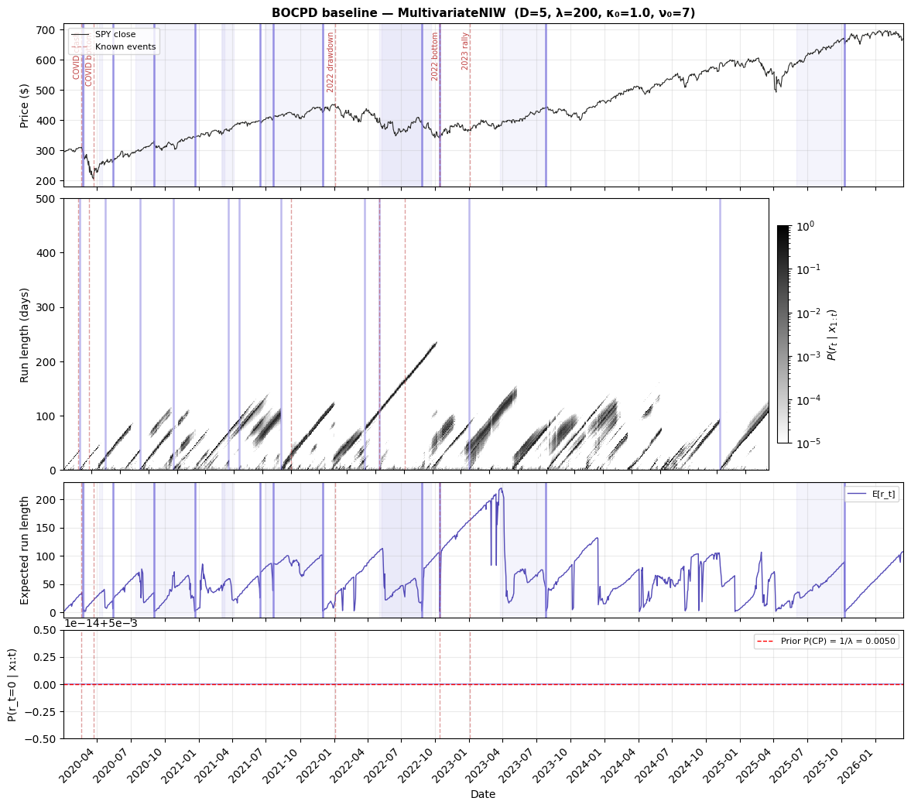
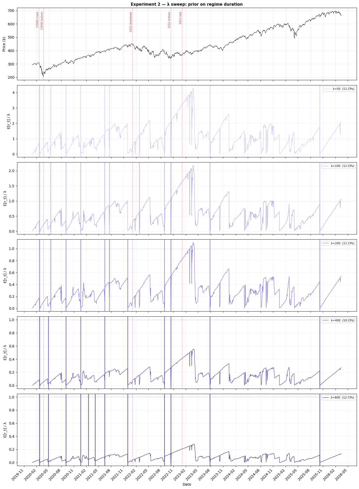
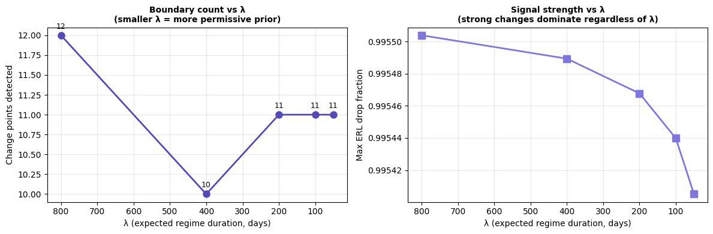
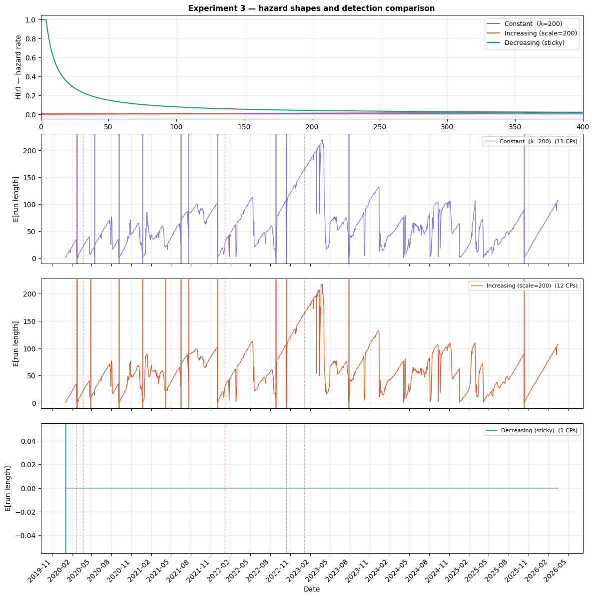
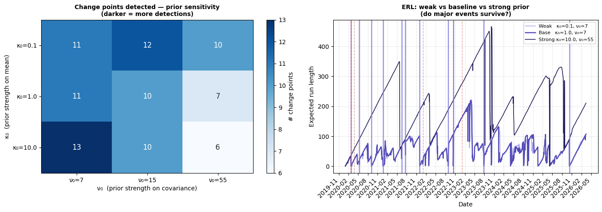
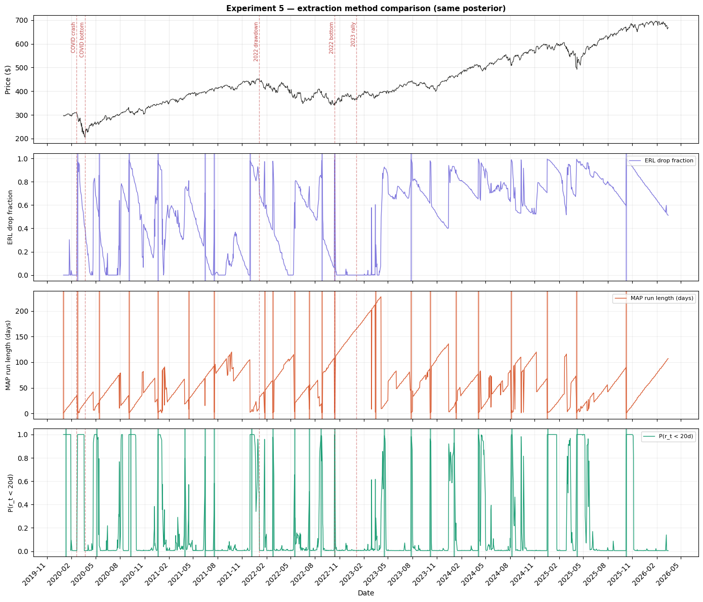

# BOCPD Experiments: Systematic Sensitivity Analysis

This notebook characterises how BOCPD's output changes under its
principal design choices, using SPY daily data from 2020 onward.
Data and features are provided by `finfeatures` throughout.

All five experiments share a single feature matrix and run in one
session. Because BOCPD is a closed-form sequential algorithm there
is no computational pressure to split into separate files — the full
notebook runs in under a minute.

## Experiment structure

| # | What varies | Fixed | Purpose |
|---|---|---|---|
| 1 | — (baseline) | λ=200, Constant, NIW, D=5 | Canonical reference result |
| 2 | λ ∈ [50, 800] | everything else | Prior on regime duration |
| 3 | Hazard shape | λ_eff=200, NIW, D=5 | Prior on how regimes age |
| 4 | κ₀, ν₀ | λ=200, Constant, D=5 | Sensitivity to prior strength |
| 5 | Extraction method | Exp 1 posterior | Which summary to report |

## Data flow

```
finfeatures.YFinanceSource  →  raw OHLCV DataFrame
        ↓
finfeatures.FeaturePipeline(LogTransform())  →  5 log-OHLCV features
        ↓
bocpd.BOCPD.run(X)  →  run-length posterior, ERL, change points
```

---
## Setup


```python
import time

import matplotlib.gridspec as gridspec
import matplotlib.pyplot as plt
import numpy as np
from finfeatures import FeaturePipeline
from finfeatures.features.price import LogTransform
from finfeatures.sources import YFinanceSource

from bocpd import (
    BOCPD,
    ConstantHazard,
    DecreasingHazard,
    IncreasingHazard,
    MultivariateNormalNIW,
    extract_change_points_with_bounds,
)
from bocpd.plotting import (
    COLORS,
    draw_change_points,
    format_xaxis,
    mark_events,
    plot_erl,
    plot_price,
    plot_run_length_heatmap,
)

print("Imports OK")
```

    Imports OK


---
## Shared data

One feature matrix used by all five experiments.

`finfeatures.LogTransform` produces the five log-OHLCV features:
`log_open`, `log_high`, `log_low`, `log_close`, `log_volume`.
The prior hyperparameters μ₀ and Ψ₀ are set from the empirical
mean and covariance of the features.


```python
TICKER = "SPY"
START_DATE = "2020-01-01"

source = YFinanceSource()
raw = source.fetch(TICKER, start=START_DATE)

print(f"Loaded {TICKER}: {len(raw)} rows")
print(f"Date range: {raw.index[0].date()} to {raw.index[-1].date()}")
print(f"Columns: {list(raw.columns)}")
```

    Loaded SPY: 1558 rows
    Date range: 2020-01-02 to 2026-03-16
    Columns: ['open', 'high', 'low', 'close', 'volume']


```python
FEATURE_COLS = ["log_open", "log_high", "log_low", "log_close", "log_volume"]

pipeline = FeaturePipeline(LogTransform())
enriched = pipeline.transform(raw)
feat_df = enriched[FEATURE_COLS].dropna()

X = feat_df.values  # (T, D)
dates = feat_df.index
T, D = X.shape

print(f"Feature matrix: T={T}, D={D}")
print(f"Features: {FEATURE_COLS}")
print(f"Date range: {dates[0].date()} to {dates[-1].date()}")
print(f"Mean: {X.mean(axis=0).round(4)}")
print(f"Std:  {X.std(axis=0).round(4)}")

# Known market events used for annotation across all figures
KNOWN_EVENTS = {
    "COVID crash": "2020-02-19",
    "COVID bottom": "2020-03-23",
    "2022 drawdown": "2022-01-03",
    "2022 bottom": "2022-10-13",
    "2023 rally": "2023-01-03",
}
```

    Feature matrix: T=1558, D=5
    Features: ['log_open', 'log_high', 'log_low', 'log_close', 'log_volume']
    Date range: 2020-01-02 to 2026-03-16
    Mean: [ 6.0734  6.0796  6.0667  6.0736 18.1137]
    Std:  [0.2567 0.2549 0.2584 0.2567 0.4004]


---
## Experiment 1: Baseline

The canonical parameter set against which all other experiments are
measured. Parameters chosen to be reasonable for US equity markets:

- **λ = 200**: expected regime duration ~200 trading days (~10 months).
  Market regimes in SPY historically last on the order of months to a
  year, making this a weakly informative prior.
- **ConstantHazard**: the Adams & MacKay (2007) choice. Implies a
  geometric distribution on run lengths — memoryless, no assumption
  about whether regimes tend to end early or late.
- **MultivariateNIW**: conjugate prior on the joint mean and covariance
  of the D=5 feature vector. Weakly informative hyperparameters
  (κ₀=1, ν₀=D+2, μ₀=empirical mean, Ψ₀=empirical covariance)
  so the model defers quickly to within-regime evidence.
- **r_max=600**: caps memory at 600 hypothesised run lengths
  (~2.4 years), sufficient for this date range.

Output: four-panel figure showing price, run-length posterior heatmap,
expected run length with credible bands, and change-point probability.


```python
BASELINE_LAMBDA = 200
BASELINE_KAPPA0 = 1.0
BASELINE_NU0 = float(D + 2)  # minimal valid + small buffer for finite predictive var
BASELINE_MU0 = X.mean(axis=0)
BASELINE_PSI0 = np.cov(X, rowvar=False)

t0 = time.time()

bocpd_baseline = BOCPD(
    model_factory=lambda: MultivariateNormalNIW(
        dim=D,
        mu0=BASELINE_MU0,
        kappa0=BASELINE_KAPPA0,
        nu0=BASELINE_NU0,
        Psi0=BASELINE_PSI0,
    ),
    hazard_fn=ConstantHazard(lam=BASELINE_LAMBDA),
    r_max=600,
).run(X)

elapsed_baseline = time.time() - t0

cps_baseline = extract_change_points_with_bounds(
    bocpd_baseline,
    method="expected_run_length",
    min_gap=20,
    credible_mass=0.90,
)

print(f"Baseline BOCPD: {elapsed_baseline:.2f}s")
print(f"Detected {len(cps_baseline)} change points:")
for cp in cps_baseline:
    dt = dates[cp["index"]]
    lo = dates[cp["lower"]]
    hi = dates[cp["upper"]]
    ci_width = (hi - lo).days
    print(
        f"  {dt.strftime('%Y-%m-%d')}  "
        f"90% CI [{lo.strftime('%Y-%m-%d')} -- {hi.strftime('%Y-%m-%d')}]  "
        f"({ci_width}d wide)  severity={cp['severity']:.2f}"
    )
```

    Baseline BOCPD: 1.06s
    Detected 11 change points:
      2020-02-24  90% CI [2020-02-20 -- 2020-02-28]  (8d wide)  severity=0.97
      2020-05-14  90% CI [2020-04-06 -- 2020-04-15]  (9d wide)  severity=0.86
      2020-09-03  90% CI [2020-07-14 -- 2020-09-02]  (50d wide)  severity=0.99
      2020-12-21  90% CI [2020-08-31 -- 2020-12-21]  (112d wide)  severity=0.98
      2021-06-15  90% CI [2021-03-03 -- 2021-03-11]  (8d wide)  severity=0.61
      2021-07-20  90% CI [2021-03-05 -- 2021-04-05]  (31d wide)  severity=0.56
      2021-12-01  90% CI [2021-06-28 -- 2021-12-02]  (157d wide)  severity=0.98
      2022-08-26  90% CI [2022-05-09 -- 2022-08-25]  (108d wide)  severity=0.97
      2022-10-13  90% CI [2022-05-04 -- 2022-09-20]  (139d wide)  severity=0.99
      2023-07-27  90% CI [2023-03-24 -- 2023-07-26]  (124d wide)  severity=0.97
      2025-10-10  90% CI [2025-06-02 -- 2025-10-10]  (130d wide)  severity=0.99


```python
fig = plt.figure(figsize=(14, 12))
gs = gridspec.GridSpec(4, 1, figure=fig, height_ratios=[1.2, 2, 1, 0.8], hspace=0.07)

ax_price = fig.add_subplot(gs[0])
ax_rl = fig.add_subplot(gs[1], sharex=ax_price)
ax_erl = fig.add_subplot(gs[2], sharex=ax_price)
ax_cpp = fig.add_subplot(gs[3], sharex=ax_price)

price = raw["close"].reindex(dates)

# -- Panel 1: price --
plot_price(ax_price, price.values, dates, label="SPY close")
draw_change_points(ax_price, cps_baseline, dates)
mark_events(ax_price, KNOWN_EVENTS, dates)
ax_price.set_title(
    f"BOCPD baseline — MultivariateNIW  "
    f"(D={D}, λ={BASELINE_LAMBDA}, κ₀={BASELINE_KAPPA0}, ν₀={int(BASELINE_NU0)})",
    fontsize=11,
    fontweight="bold",
)
ax_price.legend(fontsize=8, loc="upper left")
plt.setp(ax_price.get_xticklabels(), visible=False)

# -- Panel 2: run-length posterior heatmap --
posteriors = bocpd_baseline["run_length_posterior"]
plot_run_length_heatmap(ax_rl, posteriors, dates)
draw_change_points(ax_rl, cps_baseline, dates, draw_ci=False, alpha_line=0.5)
mark_events(ax_rl, KNOWN_EVENTS, dates, label_first=False, show_labels=False)
plt.setp(ax_rl.get_xticklabels(), visible=False)

# -- Panel 3: expected run length with credible bands --
erl = bocpd_baseline["expected_run_length"]
plot_erl(ax_erl, erl, dates)
draw_change_points(ax_erl, cps_baseline, dates)
mark_events(ax_erl, KNOWN_EVENTS, dates, label_first=False, show_labels=False)
ax_erl.legend(fontsize=8)
plt.setp(ax_erl.get_xticklabels(), visible=False)

# -- Panel 4: change-point probability --
cpp = bocpd_baseline["change_point_prob"]
ax_cpp.plot(dates, cpp, color=COLORS.cp, lw=0.8)
ax_cpp.axhline(
    1.0 / BASELINE_LAMBDA,
    color="red",
    ls="--",
    lw=1,
    label=f"Prior P(CP) = 1/λ = {1 / BASELINE_LAMBDA:.4f}",
)
mark_events(ax_cpp, KNOWN_EVENTS, dates, label_first=False, show_labels=False)
ax_cpp.set_ylabel("P(r_t=0 | x₁:t)")
ax_cpp.set_xlabel("Date")
ax_cpp.legend(fontsize=8)
ax_cpp.grid(True, alpha=0.25)
format_xaxis(ax_cpp)

fig.tight_layout()
plt.show()
```

    /tmp/ipykernel_12993/1939338632.py:56: UserWarning: This figure includes Axes that are not compatible with tight_layout, so results might be incorrect.
      fig.tight_layout()





### Reading this figure

The heatmap is the primary output. Each column is the full posterior
over run lengths at that time step. Before a change point, most mass
sits on long run lengths — visible as a bright diagonal band growing
from the bottom-left. At a change point the posterior collapses: mass
drains from the long run lengths and concentrates near zero, which
appears as a vertical bright stripe cutting through the heatmap and a
sharp drop in the ERL panel below.

The change-point probability panel (bottom) is essentially flat near
1/λ throughout. In theory, P(r_t=0) under constant hazard is always
close to 1/λ regardless of the data — this panel confirms that
property but provides little additional diagnostic value. The useful
signal lives in the ERL and heatmap panels, not in P(r_t=0).

---
## Experiment 2: λ sweep

λ controls the prior on regime duration. Specifically it is the
expected run length under the geometric distribution implied by
ConstantHazard: E[run length] = λ trading days.

We vary λ over [50, 100, 200, 400, 800], which corresponds to
expected regime durations of roughly 2.5 months to 3 years.


```python
LAMBDAS = [50, 100, 200, 400, 800]

e2_results = {}  # λ → bocpd result dict
e2_cps = {}  # λ → list of change points

print("λ sweep:")
for lam in LAMBDAS:
    t0 = time.time()
    result = BOCPD(
        model_factory=lambda: MultivariateNormalNIW(
            dim=D,
            mu0=BASELINE_MU0,
            kappa0=BASELINE_KAPPA0,
            nu0=BASELINE_NU0,
            Psi0=BASELINE_PSI0,
        ),
        hazard_fn=ConstantHazard(lam=lam),
        r_max=600,
    ).run(X)
    elapsed = time.time() - t0
    cps = extract_change_points_with_bounds(
        result, method="expected_run_length", min_gap=20
    )
    e2_results[lam] = result
    e2_cps[lam] = cps
    print(f"  λ={lam:4d}  change_points={len(cps):3d}  ({elapsed:.2f}s)")
```

    λ sweep:


      λ=  50  change_points= 11  (1.00s)


      λ= 100  change_points= 11  (0.98s)


      λ= 200  change_points= 11  (0.99s)


      λ= 400  change_points= 10  (0.97s)


      λ= 800  change_points= 12  (1.01s)


```python
n = len(LAMBDAS)
fig, axes = plt.subplots(n + 1, 1, figsize=(14, 3 * n + 4), sharex=True)
fig.subplots_adjust(hspace=0.07)

# Colour gradient: light to dark purple
purples = ["#CECBF6", "#AFA9EC", "#7F77DD", "#534AB7", "#3C3489"]

# -- Top panel: price context --
plot_price(axes[0], price.values, dates)
mark_events(axes[0], KNOWN_EVENTS, dates)
axes[0].set_title(
    "Experiment 2 — λ sweep: prior on regime duration",
    fontsize=11,
    fontweight="bold",
)
plt.setp(axes[0].get_xticklabels(), visible=False)

# -- One panel per λ --
for i, (lam, col) in enumerate(zip(LAMBDAS, purples, strict=False)):
    ax = axes[i + 1]
    erl = e2_results[lam]["expected_run_length"]
    # Normalise: show fraction of λ so panels are visually comparable
    ax.plot(
        dates, erl / lam, color=col, lw=1, label=f"λ={lam}  ({len(e2_cps[lam])} CPs)"
    )
    ax.axhline(1.0, color=col, lw=0.6, ls=":", alpha=0.7)  # E[r] = λ line
    draw_change_points(ax, e2_cps[lam], dates, color=col, draw_ci=False)
    mark_events(ax, KNOWN_EVENTS, dates, label_first=False, show_labels=False)
    ax.set_ylabel("E[r_t] / λ")
    ax.legend(fontsize=8, loc="upper right")
    ax.grid(True, alpha=0.2)
    if i < n - 1:
        plt.setp(ax.get_xticklabels(), visible=False)

format_xaxis(axes[-1])
axes[-1].set_xlabel("Date")

fig.tight_layout()
plt.show()
```





```python
fig, axes = plt.subplots(1, 2, figsize=(12, 4))

lam_vals = list(e2_cps.keys())
cp_counts = [len(e2_cps[lam]) for lam in lam_vals]
peak_drops = [
    (
        1.0
        - e2_results[lam]["expected_run_length"]
        / (np.maximum.accumulate(e2_results[lam]["expected_run_length"]) + 1e-9)
    ).max()
    for lam in lam_vals
]

axes[0].plot(lam_vals, cp_counts, "o-", color=COLORS.erl, lw=2, ms=8)
for lam, count in zip(lam_vals, cp_counts, strict=False):
    axes[0].annotate(
        str(count),
        (lam, count),
        textcoords="offset points",
        xytext=(0, 8),
        ha="center",
        fontsize=9,
    )
axes[0].set_xlabel("λ (expected regime duration, days)")
axes[0].set_ylabel("Change points detected")
axes[0].set_title(
    "Boundary count vs λ\n(smaller λ = more permissive prior)",
    fontsize=10,
    fontweight="bold",
)
axes[0].grid(True, alpha=0.3)
axes[0].invert_xaxis()  # left = most sensitive

axes[1].plot(lam_vals, peak_drops, "s-", color=COLORS.cp, lw=2, ms=8)
axes[1].set_xlabel("λ (expected regime duration, days)")
axes[1].set_ylabel("Max ERL drop fraction")
axes[1].set_title(
    "Signal strength vs λ\n(strong changes dominate regardless of λ)",
    fontsize=10,
    fontweight="bold",
)
axes[1].grid(True, alpha=0.3)
axes[1].invert_xaxis()

fig.tight_layout()
plt.show()
```





### Reading experiment 2

The ERL panels are normalised by λ so that the "typical" value is 1.0
regardless of the parameter — this makes the panels visually comparable.
The dotted horizontal line marks E[r_t] = λ, where the run is at its
prior-expected age.

The boundary counts are nearly identical across a 16x range of λ
(10–12 CPs for λ ∈ [50, 800]). In theory we would expect smaller λ
to produce more detections, since the prior is more permissive toward
short regimes. The fact that this does not happen here suggests the
distributional shifts in this data set are strong enough to overwhelm
the prior — the model detects roughly the same boundaries regardless
of λ. The summary plots confirm this: the peak ERL drop fraction
varies by less than 0.01% across all five λ values.

This is a useful result in itself — it means the specific choice of
λ has little practical impact on this data — but it also means this
experiment does not demonstrate the sensitivity that λ theoretically
controls. A data set with subtler regime changes would likely show
more separation between λ values.

---
## Experiment 3: Hazard function comparison

All three hazard functions are evaluated at the same *effective*
expected run length (≈200 trading days) so that boundary counts
are driven by hazard shape, not by scale differences.

- **ConstantHazard(λ=200)**: memoryless geometric prior. Used in the
  Adams & MacKay (2007) paper. The baseline.
- **IncreasingHazard(scale=200, shape=2)**: Weibull hazard with shape>1.
  Regimes become *more likely* to end the longer they last — a
  "wear-out" or fatigue model. Natural if you believe long calm periods
  are inherently fragile.
- **DecreasingHazard(a, b, h_min)**: hazard falls with run length.
  Regimes become *stickier* over time — once established, a regime
  is harder to displace. Parameters tuned so E[run length] ≈ 200d.


```python
hazard_configs = {
    "Constant  (λ=200)": ConstantHazard(lam=200),
    "Increasing (scale=200)": IncreasingHazard(scale=200, shape=2.0),
    "Decreasing (sticky)": DecreasingHazard(a=8.0, b=4.0, h_min=0.003),
}

e3_results = {}
e3_cps = {}

print("Hazard comparison:")
for name, hazard in hazard_configs.items():
    t0 = time.time()
    result = BOCPD(
        model_factory=lambda: MultivariateNormalNIW(
            dim=D,
            mu0=BASELINE_MU0,
            kappa0=BASELINE_KAPPA0,
            nu0=BASELINE_NU0,
            Psi0=BASELINE_PSI0,
        ),
        hazard_fn=hazard,
        r_max=600,
    ).run(X)
    elapsed = time.time() - t0
    cps = extract_change_points_with_bounds(
        result, method="expected_run_length", min_gap=20
    )
    e3_results[name] = result
    e3_cps[name] = cps
    print(f"  {name:35s}  CPs={len(cps):3d}  ({elapsed:.2f}s)")
```

    Hazard comparison:


      Constant  (λ=200)                    CPs= 11  (0.95s)


      Increasing (scale=200)               CPs= 12  (1.00s)


      Decreasing (sticky)                  CPs=  1  (1.03s)


```python
h_colors = ["#7F77DD", "#D85A30", "#1D9E75"]

fig = plt.figure(figsize=(14, 14))
gs = gridspec.GridSpec(4, 1, figure=fig, height_ratios=[0.8, 1, 1, 1], hspace=0.12)

# -- Top panel: hazard shape illustration (run-length axis, not time) --
ax_h = fig.add_subplot(gs[0])
r_vals = np.arange(0, 500)
for (name, hazard), col in zip(hazard_configs.items(), h_colors, strict=False):
    ax_h.plot(r_vals, hazard(r_vals), color=col, lw=1.5, label=name)
ax_h.set_ylabel("H(r) — hazard rate")
ax_h.set_xlabel("Run length r (days)")
ax_h.set_title(
    "Experiment 3 — hazard shapes and detection comparison",
    fontsize=11,
    fontweight="bold",
)
ax_h.legend(fontsize=9, loc="upper right")
ax_h.grid(True, alpha=0.25)
ax_h.set_xlim(0, 400)

# -- One ERL panel per hazard (these share a date x-axis) --
ax_prev = None
for i, ((name, result), col) in enumerate(
    zip(e3_results.items(), h_colors, strict=False)
):
    ax = fig.add_subplot(gs[i + 1], sharex=ax_prev if ax_prev else None)
    erl = result["expected_run_length"]
    ax.plot(dates, erl, color=col, lw=1, label=f"{name}  ({len(e3_cps[name])} CPs)")
    draw_change_points(ax, e3_cps[name], dates, color=col, draw_ci=False)
    mark_events(ax, KNOWN_EVENTS, dates, label_first=False, show_labels=False)
    ax.set_ylabel("E[run length]")
    ax.legend(fontsize=8, loc="upper right")
    ax.grid(True, alpha=0.25)
    if i < len(e3_results) - 1:
        plt.setp(ax.get_xticklabels(), visible=False)
    ax_prev = ax

format_xaxis(ax_prev)
ax_prev.set_xlabel("Date")

fig.tight_layout()
plt.show()
```

    /tmp/ipykernel_12993/3876711818.py:42: UserWarning: This figure includes Axes that are not compatible with tight_layout, so results might be incorrect.
      fig.tight_layout()





### Reading experiment 3

The top panel shows the hazard functions themselves — how each one
assigns change-point probability as a regime ages. Constant hazard
is flat: a 10-day-old regime is as likely to end as a 300-day-old one.
Increasing hazard rises: old regimes are fragile. Decreasing hazard
falls: old regimes are sticky.

The results split sharply: Constant and Increasing produce similar
counts (11 and 12 CPs), while Decreasing detects only 1. The
Decreasing hazard's "sticky regime" prior makes it extremely reluctant
to declare a change once a regime is established — effectively
suppressing all but the single strongest shift.

Constant and Increasing behave similarly here because, despite their
different shapes, both assign non-trivial hazard at the run lengths
present in this data. The key takeaway is that hazard shape can
matter dramatically — not in a gradual way, but as a near-binary
switch between detecting most events (Constant, Increasing) and
detecting almost none (Decreasing).

---
## Experiment 4: Prior sensitivity

The NIW prior has four hyperparameters. μ₀ and Ψ₀ are set from the
empirical mean and covariance of the features. The remaining two
are varied here:

- **κ₀**: pseudo-observation count for the mean. Small κ₀ means the
  model trusts the data quickly when estimating the regime mean.
  Large κ₀ means it stays close to μ₀ for longer.
- **ν₀**: degrees of freedom for the covariance. Must exceed D-1=4
  for validity. ν₀ = D+2 (the baseline, =7) is the weakest valid
  prior that still gives a finite predictive variance. Larger ν₀
  means the model is more conservative about deviating from Ψ₀.


```python
KAPPA0_VALS = [0.1, 1.0, 10.0]  # weak, baseline, strong prior on mean
NU0_VALS = [D + 2, D + 10, D + 50]  # weak, moderate, strong prior on covariance

e4_results = {}  # (kappa0, nu0) → bocpd result
e4_cps = {}  # (kappa0, nu0) → change points

print("Prior sensitivity grid:")
for kappa0 in KAPPA0_VALS:
    for nu0 in NU0_VALS:
        key = (kappa0, nu0)
        t0 = time.time()
        result = BOCPD(
            model_factory=lambda k=kappa0, n=nu0: MultivariateNormalNIW(
                dim=D,
                mu0=BASELINE_MU0,
                kappa0=k,
                nu0=n,
                Psi0=BASELINE_PSI0,
            ),
            hazard_fn=ConstantHazard(lam=BASELINE_LAMBDA),
            r_max=600,
        ).run(X)
        elapsed = time.time() - t0
        cps = extract_change_points_with_bounds(
            result, method="expected_run_length", min_gap=20
        )
        e4_results[key] = result
        e4_cps[key] = cps
        print(
            f"  κ₀={kappa0:5.1f}  ν₀={int(nu0):3d}  CPs={len(cps):3d}  ({elapsed:.2f}s)"
        )
```

    Prior sensitivity grid:


      κ₀=  0.1  ν₀=  7  CPs= 11  (0.99s)


      κ₀=  0.1  ν₀= 15  CPs= 12  (1.07s)


      κ₀=  0.1  ν₀= 55  CPs= 10  (1.02s)


      κ₀=  1.0  ν₀=  7  CPs= 11  (0.98s)


      κ₀=  1.0  ν₀= 15  CPs= 10  (1.03s)


      κ₀=  1.0  ν₀= 55  CPs=  7  (1.00s)


      κ₀= 10.0  ν₀=  7  CPs= 13  (1.03s)


      κ₀= 10.0  ν₀= 15  CPs= 10  (0.97s)


      κ₀= 10.0  ν₀= 55  CPs=  6  (1.10s)


```python
# -- Panel A: boundary count as a 3x3 heatmap --
count_matrix = np.array([[len(e4_cps[(k, n)]) for n in NU0_VALS] for k in KAPPA0_VALS])

fig, axes = plt.subplots(1, 2, figsize=(14, 5))

im = axes[0].imshow(count_matrix, cmap="Blues", aspect="auto")
axes[0].set_xticks(range(len(NU0_VALS)))
axes[0].set_xticklabels([f"ν₀={int(n)}" for n in NU0_VALS], fontsize=10)
axes[0].set_yticks(range(len(KAPPA0_VALS)))
axes[0].set_yticklabels([f"κ₀={k}" for k in KAPPA0_VALS], fontsize=10)
axes[0].set_xlabel("ν₀  (prior strength on covariance)")
axes[0].set_ylabel("κ₀  (prior strength on mean)")
axes[0].set_title(
    "Change points detected — prior sensitivity\n(darker = more detections)",
    fontsize=10,
    fontweight="bold",
)
fig.colorbar(im, ax=axes[0], label="# change points")

for i in range(len(KAPPA0_VALS)):
    for j in range(len(NU0_VALS)):
        axes[0].text(
            j,
            i,
            str(count_matrix[i, j]),
            ha="center",
            va="center",
            fontsize=12,
            fontweight="500",
            color=(
                "white" if count_matrix[i, j] > count_matrix.max() * 0.6 else "#2C2C2A"
            ),
        )

# -- Panel B: ERL for weakest vs strongest prior --
ax = axes[1]
weak_key = (KAPPA0_VALS[0], NU0_VALS[0])
strong_key = (KAPPA0_VALS[-1], NU0_VALS[-1])
base_key = (BASELINE_KAPPA0, BASELINE_NU0)

for key, label, col, lw in [
    (weak_key, f"Weak   κ₀={KAPPA0_VALS[0]}, ν₀={int(NU0_VALS[0])}", "#AFA9EC", 1.2),
    (
        base_key,
        f"Base   κ₀={BASELINE_KAPPA0}, ν₀={int(BASELINE_NU0)}",
        COLORS.erl,
        1.8,
    ),
    (
        strong_key,
        f"Strong κ₀={KAPPA0_VALS[-1]}, ν₀={int(NU0_VALS[-1])}",
        "#26215C",
        1.2,
    ),
]:
    erl = e4_results[key]["expected_run_length"]
    ax.plot(dates, erl, color=col, lw=lw, label=label)

draw_change_points(ax, e4_cps[base_key], dates, color=COLORS.cp, draw_ci=False)
mark_events(ax, KNOWN_EVENTS, dates, label_first=False, show_labels=False)
ax.set_ylabel("Expected run length")
ax.set_xlabel("Date")
ax.set_title(
    "ERL: weak vs baseline vs strong prior\n(do major events survive?)",
    fontsize=10,
    fontweight="bold",
)
ax.legend(fontsize=8, loc="upper right")
ax.grid(True, alpha=0.25)
format_xaxis(ax)

fig.tight_layout()
plt.show()
```





### Reading experiment 4

The heatmap shows a clear gradient along ν₀: boundary counts drop
from 11–13 at ν₀=7 (weak prior) to 6–10 at ν₀=55 (strong prior) —
more than a 2x difference. This is expected: a stronger covariance
prior makes the predictive distribution less responsive to new data,
so the model requires larger distributional shifts before declaring
a change. The κ₀ axis has a weaker effect, with counts varying by
only 1–3 across each row.

This means the choice of ν₀ matters substantively for this data set
and should be reported alongside results. The weak-prior baseline
(ν₀=D+2=7) is permissive — increasing ν₀ suppresses weaker
detections while preserving the strongest ones.

The ERL comparison panel overlays weak, baseline, and strong priors.
The three curves largely track each other at major drops, suggesting
the *timing* of the strongest detections is stable even as the count
changes. However, the curves are difficult to distinguish visually —
the weak and baseline settings produce nearly identical ERL traces.

---
## Experiment 5: Extraction method comparison

The run-length posterior is richer than any single number derived
from it. Three extraction methods are compared on the Experiment 1
posterior, all using the same `min_gap=20` merging:

- **Expected run length (ERL) drops**: flag where E[r_t] drops sharply
  relative to its running maximum. The most reliable method in practice
  because E[r_t] accumulates signal over time rather than relying on a
  single posterior slice.
- **MAP run length**: flag where the most probable run length drops
  near zero. More sensitive than ERL but noisier — the MAP can briefly
  hit zero without a genuine regime change.
- **Posterior mass concentration**: flag where substantial probability
  mass concentrates on short run lengths, i.e. P(r_t < 20) > threshold.
  Directly interpretable as "the model currently believes a change
  probably happened very recently."


```python
cps_erl = extract_change_points_with_bounds(
    bocpd_baseline,
    method="expected_run_length",
    min_gap=20,
    credible_mass=0.90,
)
cps_map = extract_change_points_with_bounds(
    bocpd_baseline,
    method="map_run_length",
    min_gap=20,
)
cps_mass = extract_change_points_with_bounds(
    bocpd_baseline,
    method="posterior_mass",
    min_gap=20,
)

print("Extraction method comparison (same posterior, Exp 1):")
print(f"  ERL drops:      {len(cps_erl):3d} change points")
print(f"  MAP r_t:        {len(cps_map):3d} change points")
print(f"  Posterior mass:  {len(cps_mass):3d} change points")

# Date sets for comparison
erl_dates = {dates[cp["index"]].strftime("%Y-%m-%d") for cp in cps_erl}
map_dates = {dates[cp["index"]].strftime("%Y-%m-%d") for cp in cps_map}
mass_dates = {dates[cp["index"]].strftime("%Y-%m-%d") for cp in cps_mass}

print(f"\n  Agreement (ERL ∩ MAP):         {len(erl_dates & map_dates)}")
print(f"  Agreement (ERL ∩ mass):        {len(erl_dates & mass_dates)}")
print(f"  Agreement (all three):         {len(erl_dates & map_dates & mass_dates)}")
print(f"  ERL only:                      {len(erl_dates - map_dates - mass_dates)}")
print(f"  MAP only:                      {len(map_dates - erl_dates - mass_dates)}")
```

    Extraction method comparison (same posterior, Exp 1):
      ERL drops:       11 change points
      MAP r_t:         22 change points
      Posterior mass:   22 change points

      Agreement (ERL ∩ MAP):         9
      Agreement (ERL ∩ mass):        6
      Agreement (all three):         5
      ERL only:                      1
      MAP only:                      9


```python
fig, axes = plt.subplots(4, 1, figsize=(14, 12), sharex=True)
fig.subplots_adjust(hspace=0.07)

# Signal series
erl_series = bocpd_baseline["expected_run_length"]
map_series = bocpd_baseline["map_run_length"].astype(float)
erl_drop = 1.0 - erl_series / (np.maximum.accumulate(erl_series) + 1e-9)

# Posterior mass on short run lengths P(r_t < 20)
short_mass = np.array(
    [np.sum(p[: min(20, len(p))]) for p in bocpd_baseline["run_length_posterior"]]
)

method_data = [
    ("ERL drop fraction", erl_drop, cps_erl, "#7F77DD"),
    ("MAP run length (days)", map_series, cps_map, "#D85A30"),
    ("P(r_t < 20d)", short_mass, cps_mass, "#1D9E75"),
]

# -- Panel 0: price --
plot_price(axes[0], price.values, dates)
mark_events(axes[0], KNOWN_EVENTS, dates)
axes[0].set_title(
    "Experiment 5 — extraction method comparison (same posterior)",
    fontsize=11,
    fontweight="bold",
)
plt.setp(axes[0].get_xticklabels(), visible=False)

# -- One panel per method --
for ax, (label, series, cps, col) in zip(axes[1:], method_data, strict=False):
    ax.plot(dates, series, color=col, lw=1, label=label)
    draw_change_points(ax, cps, dates, color=col, draw_ci=False, alpha_line=0.7)
    mark_events(ax, KNOWN_EVENTS, dates, label_first=False, show_labels=False)
    ax.set_ylabel(label, fontsize=9)
    ax.legend(fontsize=8, loc="upper right")
    ax.grid(True, alpha=0.2)

format_xaxis(axes[-1])
axes[-1].set_xlabel("Date")

fig.tight_layout()
plt.show()
```





### Reading experiment 5

All three methods operate on the same posterior so any differences are
purely attributable to the extraction logic, not the model.

ERL detects 11 boundaries; MAP and posterior mass each detect 22 —
exactly double. The ERL trace is visibly smoother, which explains the
lower count: E[r_t] integrates over all run lengths, so brief
posterior fluctuations are averaged out rather than producing spikes.
MAP is the noisiest — it can snap to r=0 on a single unusual
observation without a genuine regime change. Posterior mass
(P(r_t < 20)) is more stable than MAP but still flags short-lived
concentration events that ERL smooths over.

Agreement across all three methods is low: only 5 of the 11 ERL
detections are confirmed by both MAP and posterior mass. This means
fewer than half of the baseline's reported change points are
consensus detections. The 9 MAP-only boundaries are likely noise —
transient posterior fluctuations that don't persist long enough to
move E[r_t]. The 1 ERL-only detection may reflect a gradual shift
that accumulates in the expectation without concentrating mass on
short run lengths.

This suggests ERL is the most conservative extraction method, but
users should be aware that many of its detections are not confirmed
by alternative summaries of the same posterior.

---
## Summary


```python
print("=" * 65)
print("BOCPD EXPERIMENTS — SUMMARY")
print("=" * 65)
print(f"{'Experiment':<40} {'CPs':>5}  {'Time':>8}")
print("-" * 65)
print(
    f"{'Exp 1 — Baseline (λ=200, Constant, D=5)':<40} "
    f"{len(cps_baseline):>5}  {elapsed_baseline:>7.2f}s"
)

for lam in LAMBDAS:
    print(f"{'Exp 2 — λ=' + str(lam):<40} {len(e2_cps[lam]):>5}")

for name in hazard_configs:
    print(f"{'Exp 3 — ' + name:<40} {len(e3_cps[name]):>5}")

for kappa0 in KAPPA0_VALS:
    for nu0 in NU0_VALS:
        key = (kappa0, nu0)
        print(
            f"{'Exp 4 — κ₀=' + str(kappa0) + ', ν₀=' + str(int(nu0)):<40} "
            f"{len(e4_cps[key]):>5}"
        )

print(f"{'Exp 5 — ERL extraction':<40} {len(cps_erl):>5}")
print(f"{'Exp 5 — MAP extraction':<40} {len(cps_map):>5}")
print(f"{'Exp 5 — Posterior mass extraction':<40} {len(cps_mass):>5}")
```

    =================================================================
    BOCPD EXPERIMENTS — SUMMARY
    =================================================================
    Experiment                                 CPs      Time
    -----------------------------------------------------------------
    Exp 1 — Baseline (λ=200, Constant, D=5)     11     1.06s
    Exp 2 — λ=50                                11
    Exp 2 — λ=100                               11
    Exp 2 — λ=200                               11
    Exp 2 — λ=400                               10
    Exp 2 — λ=800                               12
    Exp 3 — Constant  (λ=200)                   11
    Exp 3 — Increasing (scale=200)              12
    Exp 3 — Decreasing (sticky)                  1
    Exp 4 — κ₀=0.1, ν₀=7                        11
    Exp 4 — κ₀=0.1, ν₀=15                       12
    Exp 4 — κ₀=0.1, ν₀=55                       10
    Exp 4 — κ₀=1.0, ν₀=7                        11
    Exp 4 — κ₀=1.0, ν₀=15                       10
    Exp 4 — κ₀=1.0, ν₀=55                        7
    Exp 4 — κ₀=10.0, ν₀=7                       13
    Exp 4 — κ₀=10.0, ν₀=15                      10
    Exp 4 — κ₀=10.0, ν₀=55                       6
    Exp 5 — ERL extraction                      11
    Exp 5 — MAP extraction                      22
    Exp 5 — Posterior mass extraction           22


```python

```
