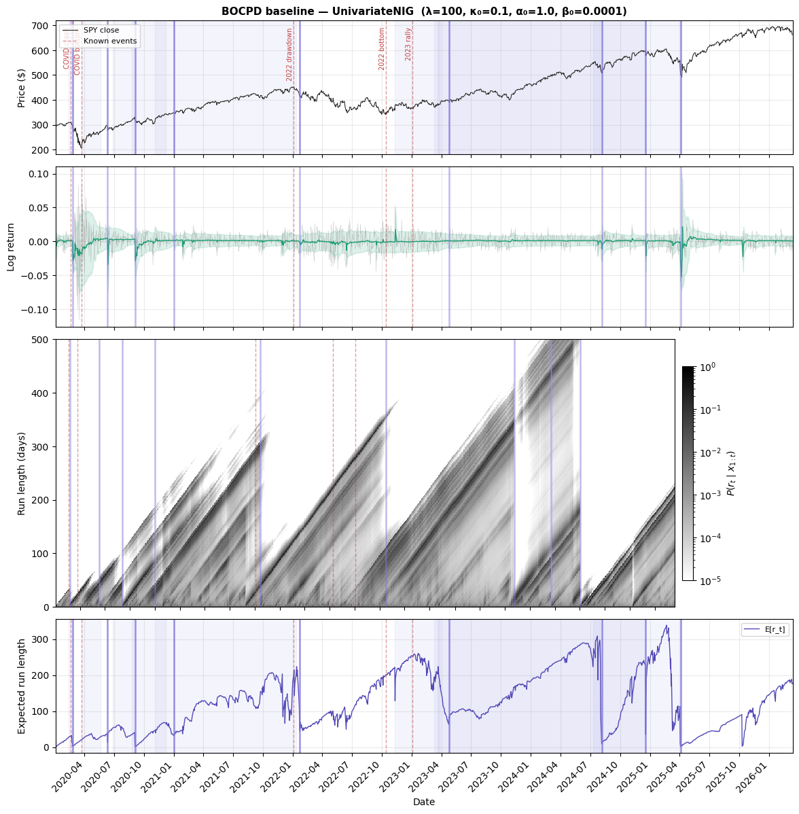
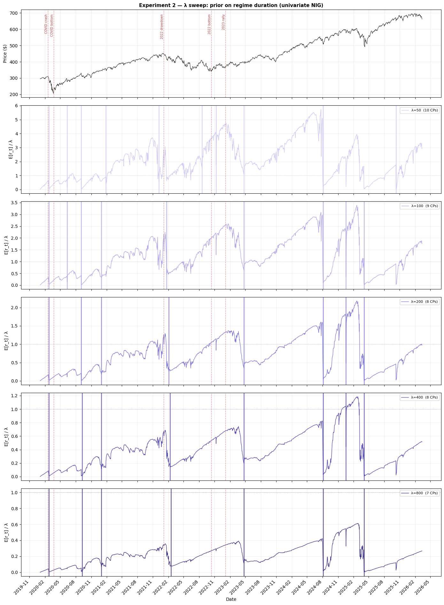
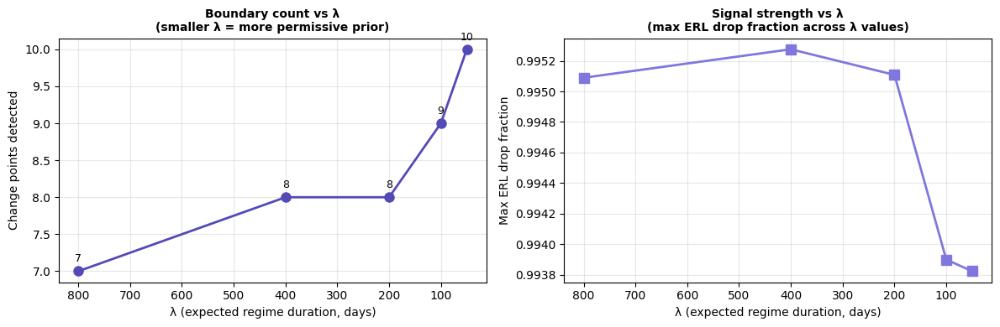
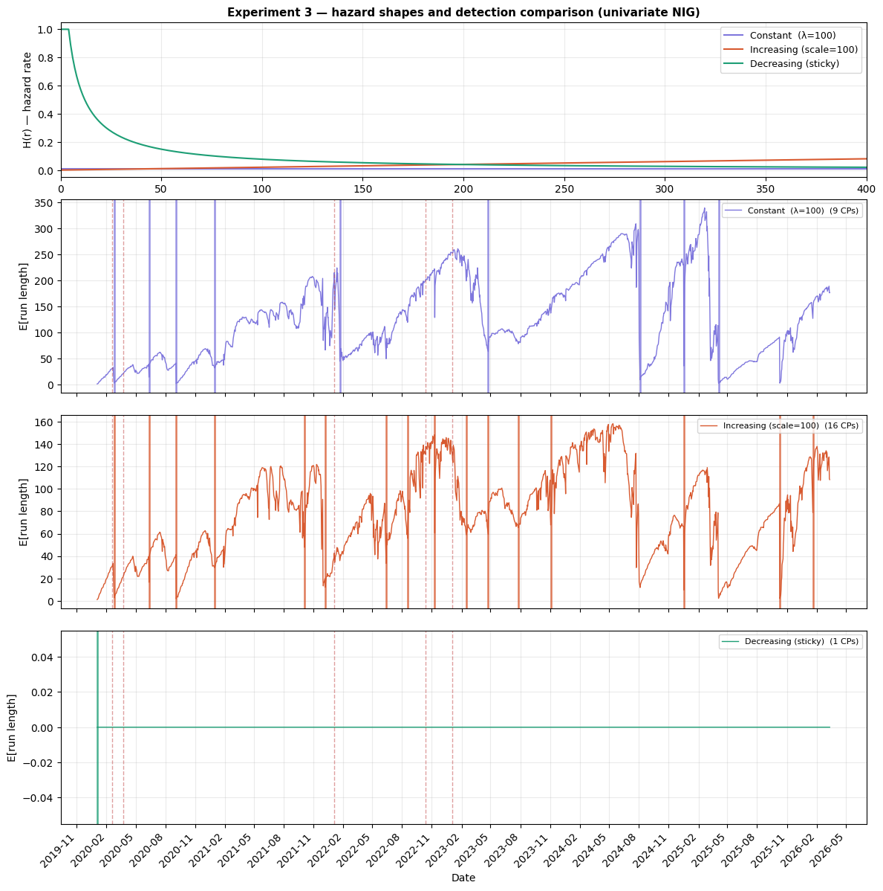
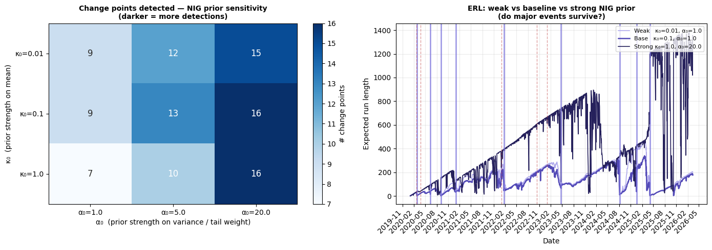
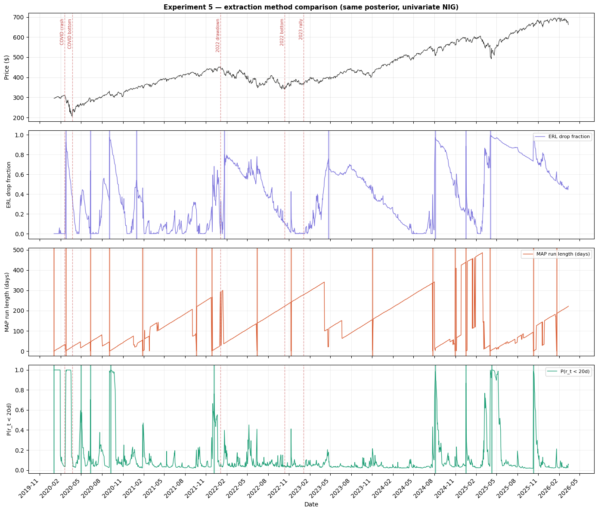

# BOCPD Experiments: Univariate NIG on Log Returns

This notebook mirrors the multivariate experiments notebook but operates
on a single feature — daily log returns of SPY — using the
Normal-Inverse-Gamma (NIG) conjugate model.

Working in 1D lets us exercise two things the multivariate NIW path
cannot: (1) the predictive envelope (one-step-ahead mean ± std), and
(2) the NIG-specific prior knobs α₀ and β₀ that control how quickly
the model adapts its variance estimate.

## Experiment structure

| # | What varies | Fixed | Purpose |
|---|---|---|---|
| 1 | — (baseline) | λ=100, Constant, NIG | Reference with predictive envelope |
| 2 | λ ∈ [50, 100, 200, 400, 800] | NIG params | Does λ matter more in 1D? |
| 3 | Hazard shape (3 functions) | λ_eff≈100 | Same three hazards |
| 4 | κ₀ ∈ [0.01,0.1,1], α₀ ∈ [1,5,20] | λ=100 | NIG prior knobs |
| 5 | Extraction method (ERL, MAP, mass) | Exp 1 posterior | Agreement rates in 1D |

## Data flow

```
finfeatures.YFinanceSource  →  SPY close prices
        ↓
np.diff(np.log(close))  →  1D log returns
        ↓
bocpd.BOCPD.run(X)  →  run-length posterior, ERL, predictive envelope
```

---
## Setup


```python
import time

import matplotlib.gridspec as gridspec
import matplotlib.pyplot as plt
import numpy as np
from finfeatures.sources import YFinanceSource

from bocpd import (
    BOCPD,
    ConstantHazard,
    DecreasingHazard,
    IncreasingHazard,
    UnivariateNormalNIG,
    extract_change_points_with_bounds,
)
from bocpd.plotting import (
    COLORS,
    draw_change_points,
    format_xaxis,
    mark_events,
    plot_erl,
    plot_predictive_envelope,
    plot_price,
    plot_run_length_heatmap,
)

print("Imports OK")
```

    Imports OK


---
## Shared data

SPY close prices from 2020-01-01 to 2026-03-16, converted to log
returns via `np.diff(np.log(close))`. This loses the first
observation, giving T ≈ 1550 time steps of a single 1D feature.


```python
TICKER = "SPY"
START_DATE = "2020-01-01"
END_DATE = "2026-03-16"

source = YFinanceSource()
raw = source.fetch(TICKER, start=START_DATE, end=END_DATE)
close = raw["close"].dropna()

print(f"Loaded {TICKER}: {len(close)} prices")
print(f"Date range: {close.index[0].date()} to {close.index[-1].date()}")
```

    Loaded SPY: 1557 prices
    Date range: 2020-01-02 to 2026-03-13


```python
log_returns = np.diff(np.log(close.values))
dates = close.index[1:]  # one shorter after differencing

X = log_returns  # 1D array for univariate NIG
T = len(X)

print(f"Log returns: T={T}")
print(f"Date range: {dates[0].date()} to {dates[-1].date()}")
print(f"Mean:  {log_returns.mean():.6f}")
print(f"Std:   {log_returns.std():.6f}")
print(f"Min:   {log_returns.min():.6f}")
print(f"Max:   {log_returns.max():.6f}")

# Known market events used for annotation across all figures
KNOWN_EVENTS = {
    "COVID crash": "2020-02-19",
    "COVID bottom": "2020-03-23",
    "2022 drawdown": "2022-01-03",
    "2022 bottom": "2022-10-13",
    "2023 rally": "2023-01-03",
}

# Store raw prices for price panels
price = close.reindex(dates)
```

    Log returns: T=1556
    Date range: 2020-01-03 to 2026-03-13
    Mean:  0.000514
    Std:   0.012958
    Min:   -0.115887
    Max:   0.099863


---
## Experiment 1: Baseline

The canonical parameter set for univariate NIG on log returns:

- **μ₀ = 0.0**: log returns are centered near zero by construction.
- **κ₀ = 0.1**: weak mean prior — trust data after ~1 observation.
- **α₀ = 1.0**: weakest proper Inverse-Gamma shape. The predictive
  distribution is Student-t with df = 2*alpha0 = 2, so tails are heavy
  and the model is initially very uncertain about variance.
- **β₀ = 0.0001**: small scale matching the empirical variance of
  daily log returns (~0.01²).
- **λ = 100**: expected regime duration ~100 trading days (~5 months).
  Shorter than the multivariate baseline (λ=200) because 1D log
  returns carry less signal per observation, so we allow the model
  to be slightly more willing to declare change points.
- **r_max**: omitted. Sequential NIG is fast — ~1300 models of 4
  floats each, no matrix operations.

Output: four-panel figure showing price with change points,
predictive envelope, run-length heatmap, and expected run length.


```python
BASELINE_LAMBDA = 100
BASELINE_MU0 = 0.0
BASELINE_KAPPA0 = 0.1
BASELINE_ALPHA0 = 1.0
BASELINE_BETA0 = 0.0001

t0 = time.time()

bocpd_baseline = BOCPD(
    model_factory=lambda: UnivariateNormalNIG(
        mu0=BASELINE_MU0,
        kappa0=BASELINE_KAPPA0,
        alpha0=BASELINE_ALPHA0,
        beta0=BASELINE_BETA0,
    ),
    hazard_fn=ConstantHazard(lam=BASELINE_LAMBDA),
).run(X)

elapsed_baseline = time.time() - t0

cps_baseline = extract_change_points_with_bounds(
    bocpd_baseline,
    method="expected_run_length",
    min_gap=20,
    credible_mass=0.90,
)

print(f"Baseline BOCPD: {elapsed_baseline:.2f}s")
print(f"Detected {len(cps_baseline)} change points:")
for cp in cps_baseline:
    dt = dates[cp["index"]]
    lo = dates[cp["lower"]]
    hi = dates[cp["upper"]]
    ci_width = (hi - lo).days
    print(
        f"  {dt.strftime('%Y-%m-%d')}  "
        f"90% CI [{lo.strftime('%Y-%m-%d')} -- {hi.strftime('%Y-%m-%d')}]  "
        f"({ci_width}d wide)  severity={cp['severity']:.2f}"
    )
```

    Baseline BOCPD: 4.72s
    Detected 9 change points:
      2020-02-25  90% CI [2020-02-13 -- 2020-02-24]  (11d wide)  severity=0.92
      2020-06-11  90% CI [2020-03-26 -- 2020-05-21]  (56d wide)  severity=0.64
      2020-09-03  90% CI [2020-06-26 -- 2020-09-02]  (68d wide)  severity=0.97
      2020-12-31  90% CI [2020-08-24 -- 2020-12-07]  (105d wide)  severity=0.54
      2022-01-21  90% CI [2020-11-04 -- 2022-01-11]  (433d wide)  severity=0.80
      2023-04-24  90% CI [2022-11-10 -- 2023-03-27]  (137d wide)  severity=0.72
      2024-08-05  90% CI [2023-03-20 -- 2024-07-31]  (499d wide)  severity=0.97
      2024-12-18  90% CI [2023-03-10 -- 2024-12-17]  (648d wide)  severity=0.85
      2025-04-04  90% CI [2024-07-10 -- 2025-04-04]  (268d wide)  severity=0.99


```python
fig = plt.figure(figsize=(14, 14))
gs = gridspec.GridSpec(4, 1, figure=fig, height_ratios=[1.0, 1.2, 2, 1], hspace=0.07)

ax_price = fig.add_subplot(gs[0])
ax_pred = fig.add_subplot(gs[1], sharex=ax_price)
ax_rl = fig.add_subplot(gs[2], sharex=ax_price)
ax_erl = fig.add_subplot(gs[3], sharex=ax_price)

# -- Panel 1: price + change points + events --
plot_price(ax_price, price.values, dates, label="SPY close")
draw_change_points(ax_price, cps_baseline, dates)
mark_events(ax_price, KNOWN_EVENTS, dates)
ax_price.set_title(
    f"BOCPD baseline — UnivariateNIG  "
    f"(λ={BASELINE_LAMBDA}, κ₀={BASELINE_KAPPA0}, "
    f"α₀={BASELINE_ALPHA0}, β₀={BASELINE_BETA0})",
    fontsize=11,
    fontweight="bold",
)
ax_price.legend(fontsize=8, loc="upper left")
plt.setp(ax_price.get_xticklabels(), visible=False)

# -- Panel 2: predictive envelope --
pred_mean = bocpd_baseline["predictive_mean"]
pred_var = bocpd_baseline["predictive_var"]
plot_predictive_envelope(ax_pred, dates, log_returns, pred_mean, pred_var)
draw_change_points(ax_pred, cps_baseline, dates, draw_ci=False, alpha_line=0.5)
mark_events(ax_pred, KNOWN_EVENTS, dates, label_first=False, show_labels=False)
ax_pred.set_ylabel("Log return")
plt.setp(ax_pred.get_xticklabels(), visible=False)

# -- Panel 3: run-length posterior heatmap --
posteriors = bocpd_baseline["run_length_posterior"]
plot_run_length_heatmap(ax_rl, posteriors, dates)
draw_change_points(ax_rl, cps_baseline, dates, draw_ci=False, alpha_line=0.5)
mark_events(ax_rl, KNOWN_EVENTS, dates, label_first=False, show_labels=False)
plt.setp(ax_rl.get_xticklabels(), visible=False)

# -- Panel 4: expected run length --
erl = bocpd_baseline["expected_run_length"]
plot_erl(ax_erl, erl, dates)
draw_change_points(ax_erl, cps_baseline, dates)
mark_events(ax_erl, KNOWN_EVENTS, dates, label_first=False, show_labels=False)
ax_erl.legend(fontsize=8)
format_xaxis(ax_erl)
ax_erl.set_xlabel("Date")

fig.tight_layout()
plt.show()
```

    /tmp/ipykernel_6509/3137169141.py:48: UserWarning: This figure includes Axes that are not compatible with tight_layout, so results might be incorrect.
      fig.tight_layout()





### Reading experiment 1

The baseline detects 9 change points — fewer than the multivariate
NIW baseline (11 with D=5, λ=200), consistent with the expectation
that a single noisy feature provides less discriminative power.

The predictive envelope (panel 2) is the key diagnostic unavailable
in the multivariate notebook. At each change point the envelope
widens sharply as the model resets its variance estimate — most
visibly during the COVID crash in early 2020, where daily log
returns swing from roughly ±1% to ±10%. Between change points the
envelope narrows as the NIG posterior accumulates evidence and
tightens its variance estimate.

The heatmap (panel 3) shows the same diagonal-band-then-collapse
pattern as the multivariate case, but the diagonal bands are
shorter on average — consistent with the shorter baseline λ=100.
Several of the detected CPs have wide 90% credible intervals
(100-600+ days), reflecting the model's genuine uncertainty about
the precise boundary location in a noisy 1D signal.

The first two CPs (2020-02-25 and 2020-06-11) bracket the COVID
volatility regime. The 2022-01-21 detection aligns with the start
of the 2022 drawdown. The 2025-04-04 CP has severity 0.99 — the
strongest detection — capturing a recent volatility shift.

---
## Experiment 2: λ sweep

λ controls the prior on regime duration under the geometric
distribution implied by ConstantHazard: E[run length] = λ days.
We vary λ over [50, 100, 200, 400, 800], corresponding to expected
durations from ~2.5 months to ~3 years.

The question is whether λ matters more in 1D than it did in the
multivariate setting, where the 5D feature vector provided enough
signal that all five λ values detected similar boundary counts.


```python
LAMBDAS = [50, 100, 200, 400, 800]

e2_results = {}
e2_cps = {}

print("λ sweep:")
for lam in LAMBDAS:
    t0 = time.time()
    result = BOCPD(
        model_factory=lambda: UnivariateNormalNIG(
            mu0=BASELINE_MU0,
            kappa0=BASELINE_KAPPA0,
            alpha0=BASELINE_ALPHA0,
            beta0=BASELINE_BETA0,
        ),
        hazard_fn=ConstantHazard(lam=lam),
    ).run(X)
    elapsed = time.time() - t0
    cps = extract_change_points_with_bounds(
        result, method="expected_run_length", min_gap=20
    )
    e2_results[lam] = result
    e2_cps[lam] = cps
    print(f"  λ={lam:4d}  change_points={len(cps):3d}  ({elapsed:.2f}s)")
```

    λ sweep:


      λ=  50  change_points= 10  (4.77s)


      λ= 100  change_points=  9  (4.85s)


      λ= 200  change_points=  8  (4.72s)


      λ= 400  change_points=  8  (4.78s)


      λ= 800  change_points=  7  (4.69s)


```python
n = len(LAMBDAS)
fig, axes = plt.subplots(n + 1, 1, figsize=(14, 3 * n + 4), sharex=True)
fig.subplots_adjust(hspace=0.07)

# Colour gradient: light to dark purple
purples = ["#CECBF6", "#AFA9EC", "#7F77DD", "#534AB7", "#3C3489"]

# -- Top panel: price context --
plot_price(axes[0], price.values, dates)
mark_events(axes[0], KNOWN_EVENTS, dates)
axes[0].set_title(
    "Experiment 2 — λ sweep: prior on regime duration (univariate NIG)",
    fontsize=11,
    fontweight="bold",
)
plt.setp(axes[0].get_xticklabels(), visible=False)

# -- One panel per λ --
for i, (lam, col) in enumerate(zip(LAMBDAS, purples, strict=False)):
    ax = axes[i + 1]
    erl = e2_results[lam]["expected_run_length"]
    ax.plot(
        dates, erl / lam, color=col, lw=1, label=f"λ={lam}  ({len(e2_cps[lam])} CPs)"
    )
    ax.axhline(1.0, color=col, lw=0.6, ls=":", alpha=0.7)
    draw_change_points(ax, e2_cps[lam], dates, color=col, draw_ci=False)
    mark_events(ax, KNOWN_EVENTS, dates, label_first=False, show_labels=False)
    ax.set_ylabel("E[r_t] / λ")
    ax.legend(fontsize=8, loc="upper right")
    ax.grid(True, alpha=0.2)
    if i < n - 1:
        plt.setp(ax.get_xticklabels(), visible=False)

format_xaxis(axes[-1])
axes[-1].set_xlabel("Date")

fig.tight_layout()
plt.show()
```





```python
fig, axes = plt.subplots(1, 2, figsize=(12, 4))

lam_vals = list(e2_cps.keys())
cp_counts = [len(e2_cps[lam]) for lam in lam_vals]
peak_drops = [
    (
        1.0
        - e2_results[lam]["expected_run_length"]
        / (np.maximum.accumulate(e2_results[lam]["expected_run_length"]) + 1e-9)
    ).max()
    for lam in lam_vals
]

axes[0].plot(lam_vals, cp_counts, "o-", color=COLORS.erl, lw=2, ms=8)
for lam, count in zip(lam_vals, cp_counts, strict=False):
    axes[0].annotate(
        str(count),
        (lam, count),
        textcoords="offset points",
        xytext=(0, 8),
        ha="center",
        fontsize=9,
    )
axes[0].set_xlabel("λ (expected regime duration, days)")
axes[0].set_ylabel("Change points detected")
axes[0].set_title(
    "Boundary count vs λ\n(smaller λ = more permissive prior)",
    fontsize=10,
    fontweight="bold",
)
axes[0].grid(True, alpha=0.3)
axes[0].invert_xaxis()

axes[1].plot(lam_vals, peak_drops, "s-", color=COLORS.cp, lw=2, ms=8)
axes[1].set_xlabel("λ (expected regime duration, days)")
axes[1].set_ylabel("Max ERL drop fraction")
axes[1].set_title(
    "Signal strength vs λ\n(max ERL drop fraction across λ values)",
    fontsize=10,
    fontweight="bold",
)
axes[1].grid(True, alpha=0.3)
axes[1].invert_xaxis()

fig.tight_layout()
plt.show()
```





### Reading experiment 2

The ERL panels are normalised by λ so panels are visually comparable.
The dotted horizontal line marks E[r_t] = λ.

Boundary counts decrease monotonically from 10 (λ=50) to 7 (λ=800).
This is a clearer gradient than the multivariate case, where counts
were nearly identical (10-12) across the same 16x range of λ. The
1D model is more sensitive to the prior because each observation
carries less information — a single log return provides weaker
evidence of a distributional shift than a 5D feature vector, so the
prior's influence is not as easily overwhelmed.

That said, the total spread is still only 3 CPs across a 16x range,
so the practical impact remains modest. The summary plots confirm
this: the max ERL drop fraction is ≥0.993 for all λ values,
meaning the strongest shifts produce near-total ERL collapses
regardless of the prior. The additional CPs at small λ are weaker
detections that the more conservative large-λ settings suppress.

---
## Experiment 3: Hazard function comparison

All three hazard functions are evaluated at the same effective
expected run length (≈100 trading days) so that boundary counts
are driven by hazard shape, not scale differences.

- **ConstantHazard(λ=100)**: memoryless geometric prior.
- **IncreasingHazard(scale=100, shape=2)**: Weibull hazard with
  shape > 1. Regimes become more likely to end the longer they last.
- **DecreasingHazard(a=8, b=4, h_min=0.003)**: hazard falls with
  run length. Regimes become stickier over time.


```python
hazard_configs = {
    "Constant  (λ=100)": ConstantHazard(lam=100),
    "Increasing (scale=100)": IncreasingHazard(scale=100, shape=2.0),
    "Decreasing (sticky)": DecreasingHazard(a=8.0, b=4.0, h_min=0.003),
}

e3_results = {}
e3_cps = {}

print("Hazard comparison:")
for name, hazard in hazard_configs.items():
    t0 = time.time()
    result = BOCPD(
        model_factory=lambda: UnivariateNormalNIG(
            mu0=BASELINE_MU0,
            kappa0=BASELINE_KAPPA0,
            alpha0=BASELINE_ALPHA0,
            beta0=BASELINE_BETA0,
        ),
        hazard_fn=hazard,
    ).run(X)
    elapsed = time.time() - t0
    cps = extract_change_points_with_bounds(
        result, method="expected_run_length", min_gap=20
    )
    e3_results[name] = result
    e3_cps[name] = cps
    print(f"  {name:35s}  CPs={len(cps):3d}  ({elapsed:.2f}s)")
```

    Hazard comparison:


      Constant  (λ=100)                    CPs=  9  (4.76s)


      Increasing (scale=100)               CPs= 16  (4.69s)


      Decreasing (sticky)                  CPs=  1  (4.71s)


```python
h_colors = ["#7F77DD", "#D85A30", "#1D9E75"]

fig = plt.figure(figsize=(14, 14))
gs = gridspec.GridSpec(4, 1, figure=fig, height_ratios=[0.8, 1, 1, 1], hspace=0.12)

# -- Top panel: hazard shape illustration --
ax_h = fig.add_subplot(gs[0])
r_vals = np.arange(0, 500)
for (name, hazard), col in zip(hazard_configs.items(), h_colors, strict=False):
    ax_h.plot(r_vals, hazard(r_vals), color=col, lw=1.5, label=name)
ax_h.set_ylabel("H(r) — hazard rate")
ax_h.set_xlabel("Run length r (days)")
ax_h.set_title(
    "Experiment 3 — hazard shapes and detection comparison (univariate NIG)",
    fontsize=11,
    fontweight="bold",
)
ax_h.legend(fontsize=9, loc="upper right")
ax_h.grid(True, alpha=0.25)
ax_h.set_xlim(0, 400)

# -- One ERL panel per hazard --
ax_prev = None
for i, ((name, result), col) in enumerate(
    zip(e3_results.items(), h_colors, strict=False)
):
    ax = fig.add_subplot(gs[i + 1], sharex=ax_prev if ax_prev else None)
    erl = result["expected_run_length"]
    ax.plot(dates, erl, color=col, lw=1, label=f"{name}  ({len(e3_cps[name])} CPs)")
    draw_change_points(ax, e3_cps[name], dates, color=col, draw_ci=False)
    mark_events(ax, KNOWN_EVENTS, dates, label_first=False, show_labels=False)
    ax.set_ylabel("E[run length]")
    ax.legend(fontsize=8, loc="upper right")
    ax.grid(True, alpha=0.25)
    if i < len(e3_results) - 1:
        plt.setp(ax.get_xticklabels(), visible=False)
    ax_prev = ax

format_xaxis(ax_prev)
ax_prev.set_xlabel("Date")

fig.tight_layout()
plt.show()
```

    /tmp/ipykernel_6509/2790807388.py:42: UserWarning: This figure includes Axes that are not compatible with tight_layout, so results might be incorrect.
      fig.tight_layout()





### Reading experiment 3

The three hazard shapes produce sharply different behaviour.
Constant detects 9 CPs, Increasing detects 16, and Decreasing
detects only 1 — mirroring the qualitative pattern from the
multivariate notebook but with a key difference.

In the multivariate case, Constant and Increasing produced similar
counts (11 vs 12). Here, Increasing nearly doubles Constant's
count (16 vs 9). The Weibull hazard's rising pressure to end
regimes has a stronger relative effect in 1D because the
observation model is less certain about regime identity — so
the hazard's "push" toward declaring a change point is less
easily overridden by the data likelihood.

The Increasing hazard's ERL trace is visibly choppier, with
frequent resets that never allow long stable regimes to develop.
The Decreasing hazard again suppresses nearly all detections: once
a regime survives its early fragile period, the falling hazard
makes it effectively permanent. The single detection it permits
is the COVID crash — the most extreme distributional shift in
the data.

---
## Experiment 4: NIG prior sensitivity

The NIG prior has four hyperparameters. μ₀ and β₀ are set from
domain knowledge (log returns center at zero with small variance).
The remaining two are varied here:

- **κ₀**: pseudo-observation count for the mean. Small κ₀ means the
  model trusts data quickly for the mean estimate. Large κ₀ anchors
  the mean to μ₀.
- **α₀**: shape of the Inverse-Gamma prior on variance. The
  predictive Student-t has df = 2*alpha0, so it directly controls tail
  heaviness. Small α₀ = heavy tails = tolerant of outliers.
  Large α₀ = lighter tails = more sensitive to variance shifts.


```python
KAPPA0_VALS = [0.01, 0.1, 1.0]
ALPHA0_VALS = [1.0, 5.0, 20.0]

e4_results = {}
e4_cps = {}

print("NIG prior sensitivity grid:")
for kappa0 in KAPPA0_VALS:
    for alpha0 in ALPHA0_VALS:
        key = (kappa0, alpha0)
        t0 = time.time()
        result = BOCPD(
            model_factory=lambda k=kappa0, a=alpha0: UnivariateNormalNIG(
                mu0=BASELINE_MU0,
                kappa0=k,
                alpha0=a,
                beta0=BASELINE_BETA0,
            ),
            hazard_fn=ConstantHazard(lam=BASELINE_LAMBDA),
        ).run(X)
        elapsed = time.time() - t0
        cps = extract_change_points_with_bounds(
            result, method="expected_run_length", min_gap=20
        )
        e4_results[key] = result
        e4_cps[key] = cps
        print(
            f"  κ₀={kappa0:5.2f}  α₀={alpha0:5.1f}  CPs={len(cps):3d}  ({elapsed:.2f}s)"
        )
```

    NIG prior sensitivity grid:


      κ₀= 0.01  α₀=  1.0  CPs=  9  (4.69s)


      κ₀= 0.01  α₀=  5.0  CPs= 12  (4.70s)


      κ₀= 0.01  α₀= 20.0  CPs= 15  (4.63s)


      κ₀= 0.10  α₀=  1.0  CPs=  9  (4.65s)


      κ₀= 0.10  α₀=  5.0  CPs= 13  (4.77s)


      κ₀= 0.10  α₀= 20.0  CPs= 16  (4.65s)


      κ₀= 1.00  α₀=  1.0  CPs=  7  (4.71s)


      κ₀= 1.00  α₀=  5.0  CPs= 10  (4.60s)


      κ₀= 1.00  α₀= 20.0  CPs= 16  (4.74s)


```python
# -- Panel A: boundary count as a 3x3 heatmap --
count_matrix = np.array(
    [[len(e4_cps[(k, a)]) for a in ALPHA0_VALS] for k in KAPPA0_VALS]
)

fig, axes = plt.subplots(1, 2, figsize=(14, 5))

im = axes[0].imshow(count_matrix, cmap="Blues", aspect="auto")
axes[0].set_xticks(range(len(ALPHA0_VALS)))
axes[0].set_xticklabels([f"α₀={a}" for a in ALPHA0_VALS], fontsize=10)
axes[0].set_yticks(range(len(KAPPA0_VALS)))
axes[0].set_yticklabels([f"κ₀={k}" for k in KAPPA0_VALS], fontsize=10)
axes[0].set_xlabel("α₀  (prior strength on variance / tail weight)")
axes[0].set_ylabel("κ₀  (prior strength on mean)")
axes[0].set_title(
    "Change points detected — NIG prior sensitivity\n(darker = more detections)",
    fontsize=10,
    fontweight="bold",
)
fig.colorbar(im, ax=axes[0], label="# change points")

for i in range(len(KAPPA0_VALS)):
    for j in range(len(ALPHA0_VALS)):
        axes[0].text(
            j,
            i,
            str(count_matrix[i, j]),
            ha="center",
            va="center",
            fontsize=12,
            fontweight="500",
            color=(
                "white" if count_matrix[i, j] > count_matrix.max() * 0.6 else "#2C2C2A"
            ),
        )

# -- Panel B: ERL for weak vs baseline vs strong prior --
ax = axes[1]
weak_key = (KAPPA0_VALS[0], ALPHA0_VALS[0])
base_key = (BASELINE_KAPPA0, BASELINE_ALPHA0)
strong_key = (KAPPA0_VALS[-1], ALPHA0_VALS[-1])

for key, label, col, lw in [
    (weak_key, f"Weak   κ₀={KAPPA0_VALS[0]}, α₀={ALPHA0_VALS[0]}", "#AFA9EC", 1.2),
    (
        base_key,
        f"Base   κ₀={BASELINE_KAPPA0}, α₀={BASELINE_ALPHA0}",
        COLORS.erl,
        1.8,
    ),
    (
        strong_key,
        f"Strong κ₀={KAPPA0_VALS[-1]}, α₀={ALPHA0_VALS[-1]}",
        "#26215C",
        1.2,
    ),
]:
    erl = e4_results[key]["expected_run_length"]
    ax.plot(dates, erl, color=col, lw=lw, label=label)

draw_change_points(ax, e4_cps[base_key], dates, color=COLORS.cp, draw_ci=False)
mark_events(ax, KNOWN_EVENTS, dates, label_first=False, show_labels=False)
ax.set_ylabel("Expected run length")
ax.set_xlabel("Date")
ax.set_title(
    "ERL: weak vs baseline vs strong NIG prior\n(do major events survive?)",
    fontsize=10,
    fontweight="bold",
)
ax.legend(fontsize=8, loc="upper right")
ax.grid(True, alpha=0.25)
format_xaxis(ax)

fig.tight_layout()
plt.show()
```





### Reading experiment 4

The heatmap reveals a strong α₀ gradient and a weaker κ₀ effect.
Moving from alpha0=1 to alpha0=20 increases detections from 7-9 to 15-16
— roughly doubling the count. This is the opposite direction from
the multivariate ν₀ result, where stronger priors *reduced*
detections. The reason: α₀ controls the predictive Student-t
degrees of freedom (df = 2*alpha0). At alpha0=1 the tails are extremely
heavy (df=2), so even large returns look plausible under the
current regime. At α₀=20 the tails are much lighter (df=40),
making the model quicker to flag outliers as evidence of a new
regime. In the multivariate case, ν₀ controls covariance
adaptation — a higher ν₀ makes the model *less* responsive.
The NIG α₀ controls tail *weight*, which has the opposite effect.

The κ₀ axis has a modest effect: at α₀=1, increasing κ₀ from
0.01 to 1.0 drops detections from 9 to 7. A stronger mean prior
anchors the model to μ₀=0, making it slightly less sensitive.
But this effect is small compared to α₀'s influence.

The ERL comparison panel shows that the weak prior (light purple)
and baseline (dark purple) track each other closely. The strong
prior (black) produces noticeably more frequent resets and a
choppier ERL trace, consistent with its higher sensitivity.

---
## Experiment 5: Extraction method comparison

Three extraction methods are compared on the Experiment 1 posterior,
all using min_gap=20 merging:

- **Expected run length (ERL) drops**: flag where E[r_t] drops
  sharply relative to its running maximum.
- **MAP run length**: flag where the most probable run length drops
  near zero.
- **Posterior mass concentration**: flag where P(r_t < 20) exceeds
  a threshold.


```python
cps_erl = extract_change_points_with_bounds(
    bocpd_baseline,
    method="expected_run_length",
    min_gap=20,
    credible_mass=0.90,
)
cps_map = extract_change_points_with_bounds(
    bocpd_baseline,
    method="map_run_length",
    min_gap=20,
)
cps_mass = extract_change_points_with_bounds(
    bocpd_baseline,
    method="posterior_mass",
    min_gap=20,
)

print("Extraction method comparison (same posterior, Exp 1):")
print(f"  ERL drops:      {len(cps_erl):3d} change points")
print(f"  MAP r_t:        {len(cps_map):3d} change points")
print(f"  Posterior mass:  {len(cps_mass):3d} change points")

# Date sets for comparison
erl_dates = {dates[cp["index"]].strftime("%Y-%m-%d") for cp in cps_erl}
map_dates = {dates[cp["index"]].strftime("%Y-%m-%d") for cp in cps_map}
mass_dates = {dates[cp["index"]].strftime("%Y-%m-%d") for cp in cps_mass}

print(f"\n  Agreement (ERL ∩ MAP):         {len(erl_dates & map_dates)}")
print(f"  Agreement (ERL ∩ mass):        {len(erl_dates & mass_dates)}")
print(f"  Agreement (all three):         {len(erl_dates & map_dates & mass_dates)}")
print(f"  ERL only:                      {len(erl_dates - map_dates - mass_dates)}")
print(f"  MAP only:                      {len(map_dates - erl_dates - mass_dates)}")
```

    Extraction method comparison (same posterior, Exp 1):
      ERL drops:        9 change points
      MAP r_t:         16 change points
      Posterior mass:    9 change points

      Agreement (ERL ∩ MAP):         3
      Agreement (ERL ∩ mass):        3
      Agreement (all three):         2
      ERL only:                      5
      MAP only:                      11


```python
fig, axes = plt.subplots(4, 1, figsize=(14, 12), sharex=True)
fig.subplots_adjust(hspace=0.07)

# Signal series
erl_series = bocpd_baseline["expected_run_length"]
map_series = bocpd_baseline["map_run_length"].astype(float)
erl_drop = 1.0 - erl_series / (np.maximum.accumulate(erl_series) + 1e-9)

# Posterior mass on short run lengths P(r_t < 20)
short_mass = np.array(
    [np.sum(p[: min(20, len(p))]) for p in bocpd_baseline["run_length_posterior"]]
)

method_data = [
    ("ERL drop fraction", erl_drop, cps_erl, "#7F77DD"),
    ("MAP run length (days)", map_series, cps_map, "#D85A30"),
    ("P(r_t < 20d)", short_mass, cps_mass, "#1D9E75"),
]

# -- Panel 0: price --
plot_price(axes[0], price.values, dates)
mark_events(axes[0], KNOWN_EVENTS, dates)
axes[0].set_title(
    "Experiment 5 — extraction method comparison (same posterior, univariate NIG)",
    fontsize=11,
    fontweight="bold",
)
plt.setp(axes[0].get_xticklabels(), visible=False)

# -- One panel per method --
for ax, (label, series, cps, col) in zip(axes[1:], method_data, strict=False):
    ax.plot(dates, series, color=col, lw=1, label=label)
    draw_change_points(ax, cps, dates, color=col, draw_ci=False, alpha_line=0.7)
    mark_events(ax, KNOWN_EVENTS, dates, label_first=False, show_labels=False)
    ax.set_ylabel(label, fontsize=9)
    ax.legend(fontsize=8, loc="upper right")
    ax.grid(True, alpha=0.2)

format_xaxis(axes[-1])
axes[-1].set_xlabel("Date")

fig.tight_layout()
plt.show()
```





### Reading experiment 5

All three methods operate on the same posterior. ERL and posterior
mass each detect 9 CPs, while MAP detects 16 — nearly double.
This mirrors the multivariate pattern where MAP was the noisiest
extractor, though the ratio is less extreme here (1.8x vs 2x).

Cross-method agreement is low: only 2 of the 9 ERL detections are
confirmed by all three methods. This is weaker consensus than the
multivariate case (5 of 11). The 1D posterior is noisier, so the
three extraction strategies diverge more in what they consider
a genuine change point vs a transient posterior fluctuation.

11 of the 16 MAP detections are MAP-only — not confirmed by either
ERL or posterior mass. These are likely brief posterior excursions
where the MAP run length snaps to zero on a single large return
without sustained evidence of a new regime. 5 of the 9 ERL
detections are ERL-only, reflecting gradual shifts that accumulate
in the expectation without concentrating mass on short run lengths.

As in the multivariate case, ERL is the most conservative method.
Users should treat low-consensus detections (ERL-only or MAP-only)
with appropriate skepticism.

---
## Summary


```python
print("=" * 65)
print("BOCPD UNIVARIATE EXPERIMENTS — SUMMARY")
print("=" * 65)
print(f"{'Experiment':<40} {'CPs':>5}  {'Time':>8}")
print("-" * 65)
print(
    f"{'Exp 1 — Baseline (λ=100, NIG)':<40} "
    f"{len(cps_baseline):>5}  {elapsed_baseline:>7.2f}s"
)

for lam in LAMBDAS:
    print(f"{'Exp 2 — λ=' + str(lam):<40} {len(e2_cps[lam]):>5}")

for name in hazard_configs:
    print(f"{'Exp 3 — ' + name:<40} {len(e3_cps[name]):>5}")

for kappa0 in KAPPA0_VALS:
    for alpha0 in ALPHA0_VALS:
        key = (kappa0, alpha0)
        print(
            f"{'Exp 4 — κ₀=' + str(kappa0) + ', α₀=' + str(alpha0):<40} "
            f"{len(e4_cps[key]):>5}"
        )

print(f"{'Exp 5 — ERL extraction':<40} {len(cps_erl):>5}")
print(f"{'Exp 5 — MAP extraction':<40} {len(cps_map):>5}")
print(f"{'Exp 5 — Posterior mass extraction':<40} {len(cps_mass):>5}")
```

    =================================================================
    BOCPD UNIVARIATE EXPERIMENTS — SUMMARY
    =================================================================
    Experiment                                 CPs      Time
    -----------------------------------------------------------------
    Exp 1 — Baseline (λ=100, NIG)                9     4.72s
    Exp 2 — λ=50                                10
    Exp 2 — λ=100                                9
    Exp 2 — λ=200                                8
    Exp 2 — λ=400                                8
    Exp 2 — λ=800                                7
    Exp 3 — Constant  (λ=100)                    9
    Exp 3 — Increasing (scale=100)              16
    Exp 3 — Decreasing (sticky)                  1
    Exp 4 — κ₀=0.01, α₀=1.0                      9
    Exp 4 — κ₀=0.01, α₀=5.0                     12
    Exp 4 — κ₀=0.01, α₀=20.0                    15
    Exp 4 — κ₀=0.1, α₀=1.0                       9
    Exp 4 — κ₀=0.1, α₀=5.0                      13
    Exp 4 — κ₀=0.1, α₀=20.0                     16
    Exp 4 — κ₀=1.0, α₀=1.0                       7
    Exp 4 — κ₀=1.0, α₀=5.0                      10
    Exp 4 — κ₀=1.0, α₀=20.0                     16
    Exp 5 — ERL extraction                       9
    Exp 5 — MAP extraction                      16
    Exp 5 — Posterior mass extraction            9


```python

```
