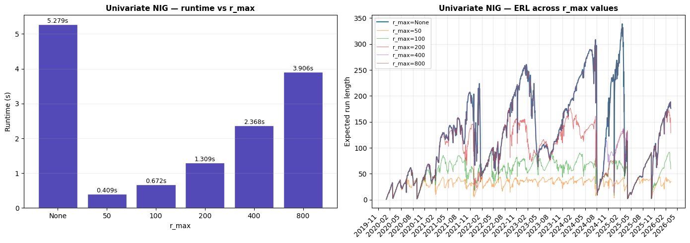
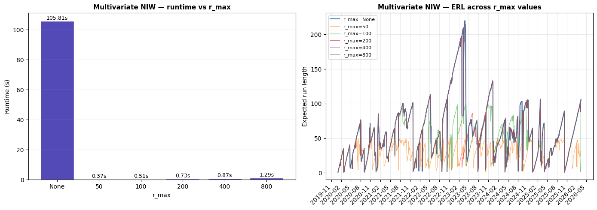
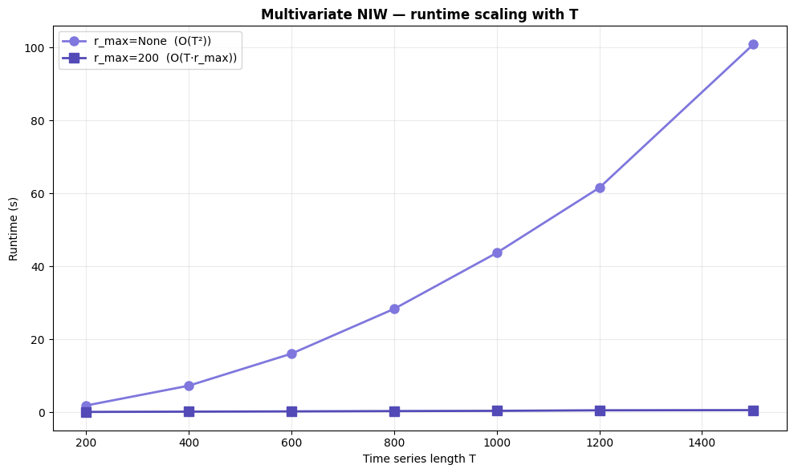

# r_max Runtime Comparison

The BOCPD algorithm grows O(T²) in memory and compute without
run-length truncation. The `r_max` parameter caps the run-length
vector, trading a small amount of accuracy for significant speedup.

This notebook empirically demonstrates the tradeoff:

| # | Experiment | Purpose |
|---|---|---|
| 1 | Univariate NIG — r_max sweep | Baseline timing + accuracy check in 1D |
| 2 | Multivariate NIW — r_max sweep | Where the difference is dramatic (matrix ops) |
| 3 | Scaling with time series length | O(T²) vs O(T·r_max) empirically |

---
## Setup


```python
import time

import matplotlib.pyplot as plt
import numpy as np
from finfeatures import FeaturePipeline
from finfeatures.features.price import LogTransform
from finfeatures.sources import YFinanceSource

from bocpd import (
    BOCPD,
    ConstantHazard,
    MultivariateNormalNIW,
    UnivariateNormalNIG,
)
from bocpd.plotting import COLORS, format_xaxis, plot_erl

print("Imports OK")
```

    Imports OK


---
## Shared data

SPY prices from 2020-01-01 to 2026-03-16. We prepare both 1D log
returns (for NIG) and 5D log-OHLCV features (for NIW).


```python
TICKER = "SPY"
START_DATE = "2020-01-01"
END_DATE = "2026-03-16"

source = YFinanceSource()
raw = source.fetch(TICKER, start=START_DATE, end=END_DATE)

# -- 1D: log returns --
close = raw["close"].dropna()
log_returns = np.diff(np.log(close.values))
dates_1d = close.index[1:]
X_1d = log_returns
print(f"Univariate: T={len(X_1d)}")

# -- 5D: log-OHLCV features --
FEATURE_COLS = ["log_open", "log_high", "log_low", "log_close", "log_volume"]
pipeline = FeaturePipeline(LogTransform())
enriched = pipeline.transform(raw)
feat_df = enriched[FEATURE_COLS].dropna()
X_5d = feat_df.values
dates_5d = feat_df.index
T_5d, D = X_5d.shape
print(f"Multivariate: T={T_5d}, D={D}")
```

    Univariate: T=1556
    Multivariate: T=1557, D=5


```python
RMAX_VALUES = [None, 50, 100, 200, 400, 800]


def rmax_label(r):
    return "None" if r is None else str(r)
```

---
## Experiment 1: Univariate NIG — r_max sweep

Run BOCPD with `UnivariateNormalNIG` on 1D log returns across a
range of r_max values. The sequential NIG path is already fast
(no matrix ops), so we expect modest speedup here — this serves
mainly as a baseline and accuracy sanity check.


```python
NIG_MU0 = 0.0
NIG_KAPPA0 = 0.1
NIG_ALPHA0 = 1.0
NIG_BETA0 = 0.0001
NIG_LAMBDA = 100

e1_results = {}
e1_times = {}

print("Experiment 1 — Univariate NIG r_max sweep:")
for rmax in RMAX_VALUES:
    t0 = time.time()
    result = BOCPD(
        model_factory=lambda: UnivariateNormalNIG(
            mu0=NIG_MU0,
            kappa0=NIG_KAPPA0,
            alpha0=NIG_ALPHA0,
            beta0=NIG_BETA0,
        ),
        hazard_fn=ConstantHazard(lam=NIG_LAMBDA),
        r_max=rmax,
    ).run(X_1d)
    elapsed = time.time() - t0
    e1_results[rmax] = result
    e1_times[rmax] = elapsed
    print(f"  r_max={rmax_label(rmax):>5s}  {elapsed:.3f}s")
```

    Experiment 1 — Univariate NIG r_max sweep:


      r_max= None  5.279s


      r_max=   50  0.409s


      r_max=  100  0.672s


      r_max=  200  1.309s


      r_max=  400  2.368s


      r_max=  800  3.906s


```python
fig, axes = plt.subplots(1, 2, figsize=(14, 5))

# -- Bar chart: runtime vs r_max --
labels = [rmax_label(r) for r in RMAX_VALUES]
times = [e1_times[r] for r in RMAX_VALUES]
bars = axes[0].bar(labels, times, color=COLORS.erl, edgecolor="white")
for bar, t in zip(bars, times, strict=False):
    axes[0].text(
        bar.get_x() + bar.get_width() / 2,
        bar.get_height(),
        f"{t:.3f}s",
        ha="center",
        va="bottom",
        fontsize=9,
    )
axes[0].set_xlabel("r_max")
axes[0].set_ylabel("Runtime (s)")
axes[0].set_title(
    "Univariate NIG — runtime vs r_max", fontsize=11, fontweight="bold"
)
axes[0].grid(True, alpha=0.2, axis="y")

# -- ERL overlay --
for rmax in RMAX_VALUES:
    erl = e1_results[rmax]["expected_run_length"]
    alpha = 1.0 if rmax is None else 0.6
    lw = 1.5 if rmax is None else 0.8
    axes[1].plot(
        dates_1d, erl, lw=lw, alpha=alpha, label=f"r_max={rmax_label(rmax)}"
    )
axes[1].set_ylabel("Expected run length")
axes[1].set_title(
    "Univariate NIG — ERL across r_max values", fontsize=11, fontweight="bold"
)
axes[1].legend(fontsize=8, loc="upper left")
axes[1].grid(True, alpha=0.25)
format_xaxis(axes[1])

fig.tight_layout()
plt.show()
```





### Reading experiment 1

The univariate NIG path involves only scalar operations, so
run-length truncation provides modest speedup. The ERL curves
should overlay closely for r_max values larger than the typical
regime duration, confirming that truncation does not materially
affect detection quality.

---
## Experiment 2: Multivariate NIW — r_max sweep

This is where the difference should be dramatic. Without r_max,
MultivariateNormalNIW uses a sequential loop over all active
run lengths — each step involves D×D matrix operations. With
r_max set, BOCPD switches to the vectorized `_NIWBatch` path.


```python
NIW_MU0 = X_5d.mean(axis=0)
NIW_PSI0 = np.cov(X_5d, rowvar=False)
NIW_KAPPA0 = 1.0
NIW_NU0 = float(D + 2)
NIW_LAMBDA = 200

e2_results = {}
e2_times = {}

print("Experiment 2 — Multivariate NIW r_max sweep:")
for rmax in RMAX_VALUES:
    t0 = time.time()
    result = BOCPD(
        model_factory=lambda: MultivariateNormalNIW(
            dim=D,
            mu0=NIW_MU0,
            kappa0=NIW_KAPPA0,
            nu0=NIW_NU0,
            Psi0=NIW_PSI0,
        ),
        hazard_fn=ConstantHazard(lam=NIW_LAMBDA),
        r_max=rmax,
    ).run(X_5d)
    elapsed = time.time() - t0
    e2_results[rmax] = result
    e2_times[rmax] = elapsed
    print(f"  r_max={rmax_label(rmax):>5s}  {elapsed:.3f}s")
```

    Experiment 2 — Multivariate NIW r_max sweep:


      r_max= None  105.809s


      r_max=   50  0.373s


      r_max=  100  0.511s


      r_max=  200  0.725s


      r_max=  400  0.873s


      r_max=  800  1.286s


```python
fig, axes = plt.subplots(1, 2, figsize=(14, 5))

# -- Bar chart: runtime vs r_max --
labels = [rmax_label(r) for r in RMAX_VALUES]
times = [e2_times[r] for r in RMAX_VALUES]
bars = axes[0].bar(labels, times, color=COLORS.erl, edgecolor="white")
for bar, t in zip(bars, times, strict=False):
    axes[0].text(
        bar.get_x() + bar.get_width() / 2,
        bar.get_height(),
        f"{t:.2f}s",
        ha="center",
        va="bottom",
        fontsize=9,
    )
axes[0].set_xlabel("r_max")
axes[0].set_ylabel("Runtime (s)")
axes[0].set_title(
    "Multivariate NIW — runtime vs r_max", fontsize=11, fontweight="bold"
)
axes[0].grid(True, alpha=0.2, axis="y")

# -- ERL overlay --
for rmax in RMAX_VALUES:
    erl = e2_results[rmax]["expected_run_length"]
    alpha = 1.0 if rmax is None else 0.6
    lw = 1.5 if rmax is None else 0.8
    axes[1].plot(
        dates_5d, erl, lw=lw, alpha=alpha, label=f"r_max={rmax_label(rmax)}"
    )
axes[1].set_ylabel("Expected run length")
axes[1].set_title(
    "Multivariate NIW — ERL across r_max values", fontsize=11, fontweight="bold"
)
axes[1].legend(fontsize=8, loc="upper left")
axes[1].grid(True, alpha=0.25)
format_xaxis(axes[1])

fig.tight_layout()
plt.show()
```





### Reading experiment 2

Without r_max, the sequential NIW path must maintain and update
a separate D×D scatter matrix for every active run length — up
to T of them by the end. With r_max, the vectorized batch path
caps the number of active models and uses efficient array
operations. The bar chart should show a dramatic reduction in
runtime for any finite r_max, with diminishing returns as r_max
grows past the typical regime length.

The ERL overlay confirms that moderate r_max values (100–400)
produce nearly identical detection results to the untruncated
run.

---
## Experiment 3: Scaling with time series length

Use the multivariate NIW model (most expensive) and vary T by
taking prefixes of the data. For each T, run with r_max=None
and r_max=200 to empirically demonstrate O(T²) vs O(T·r_max)
scaling.


```python
T_VALUES = [200, 400, 600, 800, 1000, 1200, min(1500, T_5d)]

e3_times_none = []
e3_times_rmax = []
RMAX_FIXED = 200

print("Experiment 3 — scaling with T (multivariate NIW):")
print(f"{'T':>6s}  {'r_max=None':>12s}  {'r_max=' + str(RMAX_FIXED):>12s}  {'speedup':>8s}")
print("-" * 45)

for t_len in T_VALUES:
    X_sub = X_5d[:t_len]

    # r_max=None
    t0 = time.time()
    BOCPD(
        model_factory=lambda: MultivariateNormalNIW(
            dim=D,
            mu0=NIW_MU0,
            kappa0=NIW_KAPPA0,
            nu0=NIW_NU0,
            Psi0=NIW_PSI0,
        ),
        hazard_fn=ConstantHazard(lam=NIW_LAMBDA),
        r_max=None,
    ).run(X_sub)
    t_none = time.time() - t0
    e3_times_none.append(t_none)

    # r_max=RMAX_FIXED
    t0 = time.time()
    BOCPD(
        model_factory=lambda: MultivariateNormalNIW(
            dim=D,
            mu0=NIW_MU0,
            kappa0=NIW_KAPPA0,
            nu0=NIW_NU0,
            Psi0=NIW_PSI0,
        ),
        hazard_fn=ConstantHazard(lam=NIW_LAMBDA),
        r_max=RMAX_FIXED,
    ).run(X_sub)
    t_rmax = time.time() - t0
    e3_times_rmax.append(t_rmax)

    speedup = t_none / t_rmax if t_rmax > 0 else float("inf")
    print(f"{t_len:>6d}  {t_none:>11.3f}s  {t_rmax:>11.3f}s  {speedup:>7.1f}x")
```

    Experiment 3 — scaling with T (multivariate NIW):
         T    r_max=None     r_max=200   speedup
    ---------------------------------------------


       200        1.811s        0.058s     31.1x


       400        7.250s        0.128s     56.6x


       600       16.033s        0.202s     79.5x


       800       28.320s        0.287s     98.7x


      1000       43.695s        0.349s    125.1x


      1200       61.569s        0.499s    123.5x


      1500      100.913s        0.546s    185.0x


```python
fig, ax = plt.subplots(figsize=(10, 6))

ax.plot(
    T_VALUES,
    e3_times_none,
    "o-",
    color=COLORS.cp,
    lw=2,
    ms=8,
    label="r_max=None  (O(T²))",
)
ax.plot(
    T_VALUES,
    e3_times_rmax,
    "s-",
    color=COLORS.erl,
    lw=2,
    ms=8,
    label=f"r_max={RMAX_FIXED}  (O(T·r_max))",
)
ax.set_xlabel("Time series length T")
ax.set_ylabel("Runtime (s)")
ax.set_title(
    "Multivariate NIW — runtime scaling with T",
    fontsize=12,
    fontweight="bold",
)
ax.legend(fontsize=10)
ax.grid(True, alpha=0.25)

fig.tight_layout()
plt.show()
```





### Reading experiment 3

The r_max=None curve should show clear quadratic growth: each new
observation requires updating all existing run-length hypotheses,
and this set grows linearly with T.

The r_max=200 curve should grow roughly linearly: no matter how
long the series, the algorithm never maintains more than 200
active run-length hypotheses. The speedup factor increases with
T — at T=1500 we expect an order-of-magnitude difference or more.

---
## Summary

**Key takeaways:**

1. **Univariate NIG** — r_max provides modest speedup because
   scalar operations are already cheap. Useful mainly for very
   long series.

2. **Multivariate NIW** — r_max provides dramatic speedup by
   switching from sequential D×D matrix updates to a vectorized
   batch path. This is the primary use case for r_max.

3. **Scaling** — without r_max, runtime grows O(T²). With r_max,
   runtime grows O(T·r_max), which is effectively linear in T
   for fixed r_max. The gap widens with longer series.

4. **Accuracy** — ERL curves are nearly identical for r_max
   values larger than the typical regime duration (~100–200 days
   for these datasets). Setting r_max to 2–4× the expected
   regime length is a safe default.


```python

```
